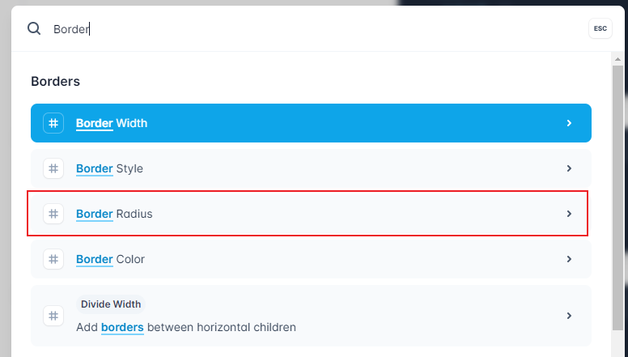
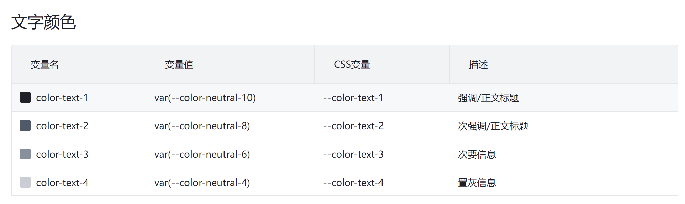

# TailwindCSS的使用，看这一篇就够了！


## 安装

以下方法是`Vite + Vue`模式下的安装方法，其他脚手架与框架的使用同理。

**创建项目**

```bash
pnpm create vite app --template vue
# yarn create vite app --template vue
# npm create vite app --template vue
```

**安装必要依赖**

Vite创建的项目默认集成了`PostCSS`，而`TailwindCSS`本身就是一个`PostCSS`插件，所以直接使用即可。

```bash
pnpm i -D tailwindcss postcss autoprefixer
# yarn add -D tailwindcss postcss autoprefixer
# npm i -D tailwindcss postcss autoprefixer
```

**创建TailwindCSS配置文件**

使用`tailwindcss`的初始化命令创建会更快：

```bash
npx tailwindcss init -p
```

这一步会做两件事：
1. 创建`postcss.config.js`文件，这里的配置主要是添加`tailwindcss`的插件，这样你编写的css才会被`tailwindcss`处理；
2. 创建`tailwind.config.js`文件，主要进行扫描规则、主题、插件等配置。

为了打包时TailwindCSS能生成对应的样式文件，需要在`tailwind.config.js`中正确配置`content`字段，如以下配置将扫描 `src` 目录下所有以 `vue/js/ts/jsx/tsx` 结尾的文件。

```js
/** @type {import('tailwindcss').Config} */
module.exports = {
  content: [
    './src/**/*.{vue,js,ts,jsx,tsx}'
  ],
  theme: {
    extend: {},
  },
  plugins: [],
}
```


::: warning 注意
TailwindCSS并不会生成一个全量的样式包，而是根据具体使用到的语法生成对应的样式代码，这样可以确保打包产生的样式包是最小的。

参考这篇文章：[https://tailwindcss.com/docs/content-configuration](https://tailwindcss.com/docs/content-configuration)
:::

**引入Tailwind的基本指令**

`tailwind.css`
```css
@tailwind base;
@tailwind components;
@tailwind utilities;
```

`main.js`
```js
import './tailwind.css'
```

## 开始使用

现在，你可以开始使用TailwindCSS的语法了：

```vue
<template>
  <div class="w-32 h-32 bg-blue-500">
  </div>
</template>

```

如上语法，你将在页面看到一个正方形的蓝色盒子：

<div class="w-32 h-32 bg-blue-500" />


::: details TailwindCSS语法检索技巧
TailwindCSS的基本原则是将每一个style语法转换为一个class，因此，在官网检索想要的样式class时，**按照样式的语法来检索是效率最高的**。如想要获取圆角的语法，只需要搜索`Border Radius`即可：


:::

## 自定义class中使用Tailwind语法？

有时候，你可能会因为重复的元素而不得不自定义一个class，如：

```html
<div class="p-2 text-gray-900 font-semibold">首页</div>
<div class="p-2 text-gray-900 font-semibold">学习TailwindCSS</div>
<div class="p-2 text-gray-900 font-semibold">TailwindCSS的设计哲学</div>
<div class="p-2 text-gray-900 font-semibold">最佳实践</div>
```

以上写法不仅在开发时会造成重复的困扰，也不利于维护，此时我们会希望给每个元素一个class，像这样：

```html
<div class="menu">首页</div>
<div class="menu">学习TailwindCSS</div>
<div class="menu">TailwindCSS的设计哲学</div>
<div class="menu">最佳实践</div>
```

现在问题来了，在为`menu`定制样式时，我们该怎样使用TailwindCSS语法呢？

TailwindCSS提供了`@apply`语法，这种语法的使用手感与在html模板中使用是一样的：

```css
.menu {
  @apply p-2 text-gray-900 font-semibold;
}
```


::: warning 注意
1. 尽管使用`@apply`语法可以解决样式复用的问题，但并不推荐在早期就进行抽象，**因为自定义class的做法会生成更多的样式代码，造成生成的css文件变得更大**。

2. 还有一个理由可以证明不使用自定义class会更好：你完全可以通过循环的语法来解决此问题：
```vue
<template>
  <div
    v-for="menu in ['首页', '学习TailwindCSS', 'TailwindCSS的设计哲学', '最佳实践']"
    :key="menu"
    class="p-2 text-gray-900 font-semibold">{{{ menu }}}</div>
</template>
```
这样未来维护时，不仅样式的修改变得更加容易，内容区也会变得更好维护。


关于样式复用的更多信息，可参考：[https://tailwindcss.com/docs/reusing-styles](https://tailwindcss.com/docs/reusing-styles)
:::


::: tip 
如果进行的是组件级别的抽象，并且有需要让他人覆盖class的场景，则必须使用自定义class的方案，别无他选。（推荐组件级别的class复用使用BEM的命名规范）
:::

## 自定义样式中使用Tailwind的变量？

大多数情况下，我们完全可以组合使用Tailwind的原子化class来解决问题。但如果就是要使用自定义的样式代码，我们该如何使用到Tailwind配置中定义的变量呢？

比如下面的代码中，希望为某个元素添加一个上边框，但是又想要使用到Tailwind配置中的`gray-200`颜色，该怎么办呢？

```css
div {
  border-top: 1px solid ?;
}
```

因为`TailwindCSS`本身是一个`PostCSS`插件，所以理论上任何有关`TailwindCSS`的配置信息都可以通过css的方式拿到。

`TailwindCSS`提供了一个`theme`函数，可以拿到`tailwind.config.js`中配置的`theme`的值：

```css
div {
  border-top: 1px solid theme('colors.gray.200');
}
```

以上代码最后会被编译为：

```css
div {
  border-top: 1px solid #e5e7eb;
}
```

::: warning 注意
`TailwindCSS`认为，所有不使用其变量的值都为魔法值。比如上方的代码，完全可以使用`1px solid #e5e7eb`来实现，但是未来如果要对颜色进行统一调整，这行代码将无法达到预期效果。

具体可参考文档：[https://tailwindcss.com/docs/functions-and-directives#theme](https://tailwindcss.com/docs/functions-and-directives#theme)
:::


## 使用Tailwind配置之外的变量？

有时候，你不得不使用一些超出Tailwind配置之外的值，当你接到一个需求：

> 在页面绘制一个宽139px，高77px，颜色为#165DFF的盒子。

你找遍了TailwindCSS文档，都没找到可以直接使用的原子化class，这时候，你可能不得不写一些样式：

```css
div {
  width: 139px;
  height: 77px;
  background-color: #165DFF;
}
```

如果是这样，那岂不是违背了TailwindCSS宣称的 **让开发人员不离开html** 的目标？

是的！你永远可以相信TailwindCSS！！因为这种情况，它都考虑到了：

```html
<div class="w-[139px] h-[77px] bg-[#165DFF]"></div>
```

<div class="w-[139px] h-[77px] bg-[#165DFF]"></div>

::: tip
使用这种方法有两个好处：
1. 开发人员不用离开html，手感还是那个手感，效率更高；
2. 同样的class还是只生成一份样式（10个`w-[139px]`最终只会生成一份样式代码），减少了打包后的样式文件大小
:::

::: warning 注意
尽管这种方法可以优雅地解决问题，但这种 **魔法值** 的方案并不被推荐，因为事实上，这种做法会让样式体系超出规范的范围。如果项目中充斥着这种代码，会给后期的维护造成困难。

参考文档：[https://tailwindcss.com/docs/adding-custom-styles#using-arbitrary-values](https://tailwindcss.com/docs/adding-custom-styles#using-arbitrary-values)
:::

## 全面且好用的响应式方案

在`TailwindCSS`中写响应式简直是福音，例如这个绿色（如果你使用PC访问，将是蓝色）的盒子：


<div class="w-32 h-32 bg-green-500 md:bg-blue-500" />

```html
<div class="w-32 h-32 bg-green-500" />
```

如果要想让其在`768px`以上的屏幕上显示为蓝色，你需要这样：

```css
@media (min-width: 768px) {
  div {
    @apply bg-blue-500;
  }
}
```

而`TailwindCSS`只需要一行代码：

```html
<div class="w-32 h-32 bg-green-500 md:bg-blue-500" />
```

以上代码表示的含义是：默认显示绿色，在最小为`md(768px)`的屏幕下显示蓝色。

`TailwindCSS`响应式的规则为：

1. **`mobile first`**，即**手机端优先**，你也可以理解为，什么断点都不设置就相当于断点为0；
2. 断点的含义是 **大于等于**，即`min-width`，而非`max-width`。具体可参考文档：[https://tailwindcss.com/docs/responsive-design#targeting-mobile-screens](https://tailwindcss.com/docs/responsive-design#targeting-mobile-screens)

> 具体响应式断点可参考文档：[https://tailwindcss.com/docs/screens](https://tailwindcss.com/docs/screens)

::: details 高级用法
你甚至可以结合任意值语法，实现各种变态的响应式需求，如：

> 下面的这个盒子，让它在1300px以下（包含1300px）屏幕下显示绿色，以上显示蓝色。

<div class="w-32 h-32 max-[1300px]:bg-green-500 bg-blue-500"></div>

```html
<div class="w-32 h-32 max-[1300px]:bg-green-500 bg-blue-500"></div>
```

为TailwindCSS的设计拍案叫绝！！

:::

## 暗黑模式

使用暗黑模式前，你需要在`tailwind.config.js`中配置：

```js
/** @type {import('tailwindcss').Config} */
module.exports = {
  darkMode: 'class',
  // more options...
}

```

然后，你只需要少量的代码，就可以使用暗黑模式了：

```html
<div class="w-32 h-32 bg-blue-500 dark:bg-green-500"></div>
```

<div class="w-32 h-32 bg-blue-500 dark:bg-green-500"></div>

> 点击右上角切换暗黑模式，上方的蓝色盒子将变成绿色盒子。

更多使用方法可参考文档：[https://tailwindcss.com/docs/dark-mode](https://tailwindcss.com/docs/dark-mode)

## 重写/覆盖Tailwind配置

Tailwind的默认配置与团队的UI规范有出入？莫担心，TailwindCSS提供了一整套的重写、覆盖默认配置的方案，细粒度到每一个属性。


举个栗子，使用Tailwind的配置来实现`Arco Design`的字体颜色规范：




```js
// tailwind.config.js

/** @type {import('tailwindcss').Config} */
module.exports = {
  theme: {
    extend: {
      textColor: { // [!code focus:5]
        primary: '#1D2129',
        regular: '#4E5969',
        secondary: '#86909C',
        disabled: '#C9CDD4',
      }
    },
  },
  // ...
}
```

然后就可以使用了：

```html
<span class="text-primary">主色</span> / 
<span class="text-regular">常规色</span> / 
<span class="text-secondary">次要色</span> / 
<span class="text-disabled">禁用色</span> / 
```

效果如下：

<span class="text-primary">主色</span> / 
<span class="text-regular">常规色</span> / 
<span class="text-secondary">次要色</span> / 
<span class="text-disabled">禁用色</span> / 

> 配置太多，就不赘述了，具体可参考：[https://github.com/tailwindlabs/tailwindcss/blob/master/stubs/defaultConfig.stub.js](https://github.com/tailwindlabs/tailwindcss/blob/master/stubs/defaultConfig.stub.js)


## 放弃使用预处理器

在开始本小节，请读者思考一个问题：

> Sass/Less/Stylus等预处理器，给我们带来了什么？

在没有预处理器前，我们的CSS代码是这样的：

```css
.foo {
  font-size: 12px;
}
.foo .bar {
  font-size: 14px;
}
```

有了预处理器后，代码被简化了：

```scss
.foo {
  font-size: 12px;
  .bar {
    font-size: 14px;
  }
}
```

预处理器在 `嵌套语法`、`变量`、`常用函数`、`逻辑处理` 等方面相比原生CSS有更大的优势，它可以让编写CSS代码的效率变得更高。

但是！！请注意！！当我们使用TailwindCSS时，实际推崇的是TailwindCSS官方“标榜”（实际已经不是标榜了，很多都做
到了）的 **不离开html** 、**少样式代码甚至零样式代码** 的价值观。


::: tip 总结
预处理器的核心优势是为了让开发人员更快书写样式代码，而TailwindCSS旨在消除样式代码，既然开发人员都不用写样式代码了，那还需要预处理器干嘛？:smile:
:::

因此，TailwindCSS官方极力推荐在项目中移除预处理器，具体可参考文档：[https://tailwindcss.com/docs/using-with-preprocessors](https://tailwindcss.com/docs/using-with-preprocessors)

**如果仍然需要使用嵌套语法，怎么办？**

TailwindCSS封装了[postcss-nested](https://github.com/postcss/postcss-nested)与[postcss-nesting](https://github.com/jonathantneal/postcss-nesting)插件，抛出了一个新的postcss插件，你只需要在`postcss.config.js`文件中加入以下代码，即可在css文件中使用嵌套语法了：

```js
module.exports = {
  plugins: {
    'tailwindcss/nesting': {}, // [!code focus]
    tailwindcss: {},
    autoprefixer: {},
  },
}

```

更多细节可参考：[https://tailwindcss.com/docs/using-with-preprocessors#nesting](https://tailwindcss.com/docs/using-with-preprocessors#nesting)


::: warning 注意
实际上，当你在sass/scss/less/styl文件中使用Tailwind语法时，可能会发生错误的预期甚至错误，因为TailwindCSS的某些语法可能会与预处理器的语法冲突，如在sass文件中使用`theme`函数会得到不同的预期，因为sass中也存在这个函数，而这种写法会让sass预处理器优先处理这个函数，而实际的期望是希望后处理器来处理。
:::

::: details 预处理器的未来？
参考文章：[预处理器的未来？](./%E9%A2%84%E5%A4%84%E7%90%86%E5%99%A8%E7%9A%84%E6%9C%AA%E6%9D%A5%EF%BC%9F.md)
:::


***
