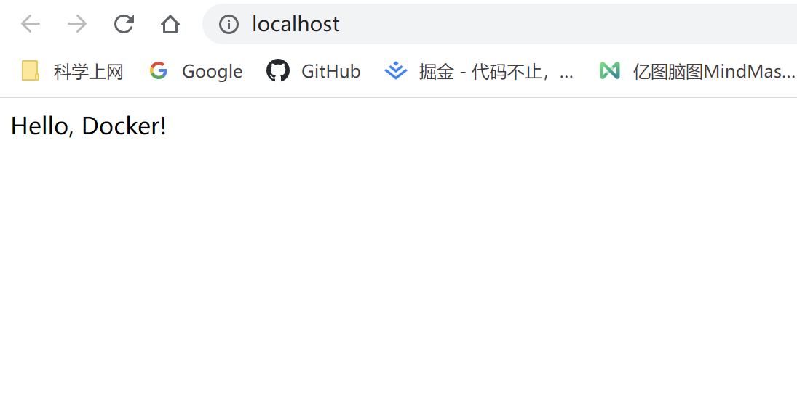
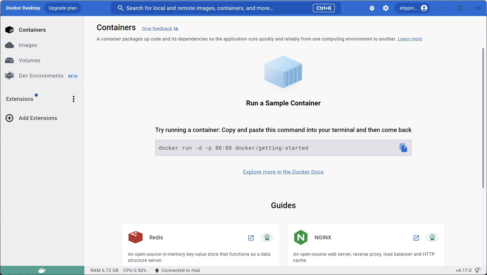
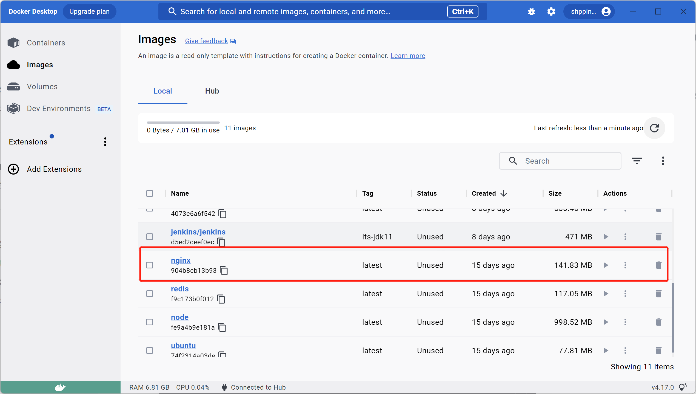
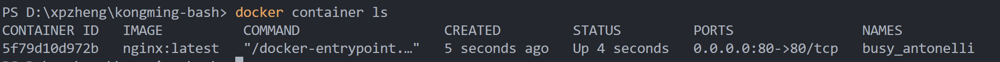
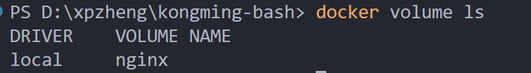

# Docker基础

本文适用于第一次入门Docker的新手，如果你开始注意到Docker，<span class="text-pink-600">恭喜你！你将成为一个幸福的人。</span>因为在学完Docker后，相信你会跟我一样，感叹与Docker的相识简直是相见恨晚！

如果告诉你，可以用 **一行命令将nginx运行起来**，你会不会感到惊讶？

如果告诉你，还是 **一行命令，不仅将nginx运行起来，并且将你的网站运行在其中** ，你是否会感到惊讶？

先不要惊讶。让我们现在就开始动手，将上面不可思议的事情变成现实！


## 开胃菜：在Docker上跑一个服务器

首先，我们在本地D盘的hello-docker目录，新建一个index.html文件，内容如下：

```html
<html lang="en">
<head>
  <meta charset="UTF-8">
  <title>Hello</title>
</head>
<body>

  Hello, Docker!
  
</body>
</html>
```

然后，打开控制台，运行一行命令：

```bash
docker run -d -p 80:80 -v d:/hello-docker:/usr/share/nginx/html nginx:latest
```

紧接着，我们打开 `http://localhost/` ，奇妙的事情发生了：




整个过程不到1分钟，我们已经将开发的内容部署到nginx服务器上了！！

是的，这就是Docker。事实上，Docker可以让你只需要输入一行命令，就将一个整合了前后端及各种中间件的庞大的系统运行起来，并且当你更换主机时，仍然还是熟悉的一行命令搞定一切事情。


## 理解Docker

事实上， **你的软件如何配合运行是确定的** ，例如一个简单的博客系统，至少由以下三个部分构成：

- 数据库
- 服务端
- web客户端

为了让你的博客应用跑起来，你可能需要这些步骤：

1. 安装mysql，设置用户名与密码
2. 运行mysql
3. 起一个node服务器（如express或koa），连接mysql，这个步骤需要指定主机名、端口、用户名、密码等信息
4. 运行nginx服务器，将开发的代码部署在其上，此步骤根据需要可能需要修改nginx的配置文件

**你会发现，不管你换多少台主机进行部署，你总是要重复上面的步骤，而这些步骤只是在第一次思考它时具有价值，后续的所有劳作都是冗余的、无意义的。**

Docker就是来管理这些步骤的，正如它的名字（Dock：船坞），Docker是一个码头工人，负责搬运你的货物（应用），将你的工作中最为枯燥、无意义的一部分彻底接管。

长话短说，你可以认为：

有了Docker，你再也不需要亲力亲为去安装和配置那些复杂的软件，软件供应商会将自己的软件以及它的运行环境打包好，你只要吩咐Docker将它们搬过来，然后按一下开机键，就可以运行了。


## 理解镜像与容器的关系

前面的叙述涉及到Docker最核心的两个概念：软件供应商打包好的可运行的货物，称为 **镜像** ，而你运行的，称为 **容器** 。（注意，镜像与容器并不是一对一的关系，这里的叙述并不准确，详情请继续阅读）

如果你是一个有面向对象开发经验的开发者，理解镜像与容器的关系非常简单，镜像就是类，容器就是对象（或实例）。

如果你不是，那么你可以简单理解这些关系：

- **镜像 = 菜谱。** 例如nginx镜像就如鱼香茄子的菜谱，详细说明了鱼香茄子的制作过程（调料、原料、锅、火候等）；
- **Docker = 厨师。** Docker从码头工人摇身一变成为米其林大厨，它负责按照菜谱的要求准备材料并烹饪你的美食；
- **容器 = 菜。** 当Docker这个“大厨”完成烹饪后，你就获得了一份鱼香茄子。

因此，你可以让Docker炒5份鱼香茄子（一个镜像运行多个容器，构造集群环境），同一份菜，可能有多个菜谱，可能有的菜谱做出的鱼香茄子会有一些地方特色，例如广东的鱼香茄子会加入沙茶酱（同一类镜像可能有多个版本，有一些会提供一些已有配置或高级特性，例如nginx的官方镜像和其他厂商实现的镜像）。

同时，不同的菜，菜谱的厚度是不同的，西红柿炒蛋可能1页就够，可是满汉全席可能需要一本书（不同镜像的大小是不一的，可以简单认为镜像要做的事情越多越杂，镜像就越大）。

## 安装Docker

推荐以Windows作为入门Docker的平台，因为Windows版的Docker Desktop有很良好的界面，对于新手而言非常友好。



> 下载链接：[https://www.docker.com/](https://www.docker.com/)


## 如何将一个容器跑起来？

还是以菜谱、厨师与菜的关系来理解，首先：

**第一步：你得有个厨师（安装Docker）**


**第二步：要根据你的需求，获取你的菜谱，这个过程被称为拉取镜像。**

例如你想获得一个nginx镜像，只需要使用这个命令即可：

```bash
docker pull nginx:latest
# 或：
# docker image pull nginx:latest
```

你可以使用 `docker image ls` 或直接在Docker Desktop中查看刚刚拉取的镜像：



**第三步：吩咐厨师，做菜！（运行镜像，容器化/实例化）**

```bash
docker run -d -p 80:80 nginx:latest
```

最后，打开 `http://localhost` ，就可以食用你的美食了！


## 制作自己的“菜谱”

前面我们说过，镜像是菜谱，Docker是厨师，容器是菜，那我们能不能让Docker在做菜的时候放点其他调料呢？不能。厨师会忠实地按照菜谱做菜，并不会改造菜谱。那如何做一份定制的鱼香茄子呢？你需要执行以下步骤：

1. 按照鱼香茄子的菜谱，制作一份自己的菜谱（例如在出锅前放一勺糖）；
2. 吩咐厨师，按照自己的菜谱做菜，做出符合自己口味的鱼香茄子。

这个制作定制菜谱的过程就是 **镜像制作** 。

镜像制作需要的核心元素就是 `Dockerfile`，相信你曾经不止一次看到过它，它就是“菜谱”，用来描述你定制的这道菜的制作过程。让我们来看一个简单的例子：

```docker
FROM nginx:latest

COPY . /usr/share/nginx/html
```

- `FROM nginx:latest` 基于nginx镜像制作新的镜像，好比基于鱼香茄子的菜谱制作自己的鱼香茄子菜谱
- `COPY . /usr/share/nginx/html` 将目录内容拷贝到nginx的入口目录，这样未来运行nginx时，就能跑起自己的项目了

接下来，你需要开始制作镜像：

```
docker build -t mynginx:latest .
```

## 不如？现在就来运行一个博客？

首先，我们需要运行一个数据库来存储我们博客的数据，不如就mysql吧。打开命令行运行命令：

```bash
docker run -d -p 3306:3306 -e MYSQL_ROOT_PASSWORD=root -e MYSQL_DATABASE=blog mysql:latest
```

::: details 命令详解：
- `-d` 后台运行
- `-p 3306:3306` 暴露端口，将内部3306端口映射到本机3306端口（如果本机存在mysql并已运行，则会发生端口占用报错）
- `-e MYSQL_ROOT_PASSWORD=root` 设置mysql的root用户密码为 `root`
- `-e MYSQL_DATABASE=blog` 设置mysql默认数据库，这里设置为blog，会自动创建
- `mysql:latest` 使用mysql的latest版本作为镜像
:::

mysql容器运行后，你可以通过例如Navicat等数据库客户端连接，因为它的端口已经暴露到了本机。

接下来，我们来运行一个node服务器并连接mysql。

<Todo />

## Docker学习路线

- 安装Docker
- 理解镜像与容器的关系
- 使用官方镜像，在Docker上跑一个服务器
- 自己制作一个镜像
- 常用Docker命令
- 多容器
- 认识Docker Compose
- Docker知识体系
- 分布式？
- 未完待续...


## 常用命令

### 镜像

**列出所有镜像**

```bash
docker image ls
```

**删除镜像**

```bash
docker image rm nginx:latest
```

**制作镜像**

```bash
docker build -t myimage:1.0 . -f /xxx/yyy/Dockerfile
```

### 容器

**运行容器**


```bash
docker run -d -p 80:80 --mount source=nginx,target=/usr/share/nginx/html nginx:latest
```

- `-d` 后台运行
- `-p` 暴露端口
- `--mount` 挂载卷

**停止运行容器**

```bash
docker stop 5f79d10d97
```

`5f79d10d97` 表示容器运行的唯一标识。


**列出正在运行的镜像**

```bash
docker container ls
```



**删除容器**

```bash
docker container rm 5f79d10d97
```

### 卷

**创建卷**

```bash
docker volume create nginx
```

**列出所有卷**

```bash
docker volume ls
```




**运行时绑定卷**

方法1：指定卷名（需要先创建卷，如果没创建，docker会自动创建）

```bash
docker run -d -p 80:80 --mount source=my-volume,target=/usr/share/nginx/html nginx:latest
```

方法2：自行指定目录（更灵活）

```bash
docker run -d -p 80:80 --mount type=bind,src=d:/nginx,target=/usr/share/nginx/html nginx:latest
```

**删除指定卷**

```bash
docker volumn rm nginx
```

### 网络

**列出所有网络**

```bash
docker network ls
```
