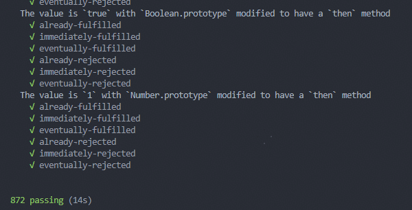

# Promise

## 规范

[Promises/A+](https://promisesaplus.com/)

[Promises/A+（中文）](https://github.com/lingirlsea/promisesaplus/blob/master/README.md)

## 手写Promise

```ts

type ResolveFn<T> = (value: T) => void
type RejectFn<T> = (reason: any) => void
type Executor<T> = (resolve: ResolveFn<T>, reject: RejectFn<T>) => void
type OnFulfilled<T> = (value: T) => any // TODO 改进
type OnRejected<T> = (reason: any) => any // TODO 改进

type State = 'pending' | 'fulfilled' | 'rejected'

interface ThenHandler<T> {
  promise: MyPromise<T>
  onFulfilled: OnFulfilled<T>
  onRejected: OnRejected<T>
}

function isFunction(val: any) {
  return val && typeof val === 'function'
}

export default class MyPromise<T> {

  protected state: State = 'pending'
  protected result: any
  // 将处理与拒绝函数保存在Promise内部，方便后续获取
  protected resolve: ResolveFn<T>
  protected reject: RejectFn<T>

  private thenHandlers: ThenHandler<unknown>[] = []

  constructor(executor?: Executor<T>) {
    this.resolve = (value: T) => {
      if (this.state !== 'pending') return
      const doResolve = (value: T) => {
        this.result = value
        this.state = 'fulfilled'
        this.runThenHandlers()
      }

      MyPromise.resolvePromise(this, value, doResolve, this.reject)
    }
    this.reject = (reason: any) => {
      if (this.state !== 'pending') return
      this.result = reason
      this.state = 'rejected'
      this.runThenHandlers()
    }
    if (executor) {
      try {
        executor(this.resolve, this.reject)
      } catch (err) {
        this.reject(err)
      }
    }
  }

  private runThenHandlers(index?: number) {
    if (this.state === 'pending') return

    const list = !index ? this.thenHandlers : this.thenHandlers.slice(index, index + 1)
    list.forEach(({ onFulfilled, onRejected, promise }) => {
      const resolve = promise.resolve
      const reject = promise.reject
      try {
        if (this.state === 'fulfilled') {
          if (onFulfilled && isFunction(onFulfilled)) {
            // 注意：将then的回调放在微任务队列里跑
            queueMicrotask(() => {
              try {
                const x = onFulfilled(this.result)
                MyPromise.resolvePromise(promise, x, resolve, reject)
              } catch (err) {
                reject(err)
              }
            })
          } else {
            resolve(this.result)
          }
        } else if (this.state === 'rejected') {
          if (onRejected && isFunction(onRejected)) {
            queueMicrotask(() => {
              try {
                const x = onRejected(this.result)
                MyPromise.resolvePromise(promise, x, resolve, reject)
              } catch (err) {
                reject(err)
              }
            })
          } else {
            reject(this.result)
          }
        }
      } catch (err) {
        reject(err)
      }
    })
  }

  public then(onFulfilled?: OnFulfilled<T>, onRejected?: OnRejected<T>) {
    const nextPromise = new MyPromise()

    this.thenHandlers.push({
      promise: nextPromise,
      onFulfilled,
      onRejected,
    })

    if (this.state !== 'pending') {
      this.runThenHandlers(this.thenHandlers.length - 1)
    }

    return nextPromise
  }
  

  private static resolvePromise<T>(promise: MyPromise<T>, x: any, resolve: ResolveFn<T>, reject: RejectFn<T>) {
    if (promise === x) {
      throw new TypeError('promise is equal to x')
    }
    // 处理的值本身是Promise，继承此Promise的状态
    if (x instanceof MyPromise) {
      if (x.state === 'pending') {
        x.then(resolve, reject)
      } else if (x.state === 'fulfilled') {
        resolve(x.result)
      } else if (x.state === 'rejected') {
        reject(x.result)
      }
      return
    }

    // 处理的值是一个thenable，按照thenable的resolve和reject进行处理
    if (x != null && (typeof x === 'object' || isFunction(x))) {
      let called = false
      try {
        const then = x.then
        if (!isFunction(then)) return resolve(x)

        // 为什么不使用x.then？防止多次调用x的getter造成副作用
        then.call(x, (y: any) => {
          if (called) return
          MyPromise.resolvePromise(promise, y, resolve, reject)
          called = true
        }, (err: any) => {
          if (called) return
          reject(err)
          called = true
        })
      } catch (err) {
        if (called) return
        reject(err)
      }
      return
    }

    // 非Promise、非thenable，直接处理
    resolve(x)
  }

}


```

## 跑通官方872个测试用例

