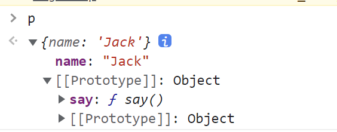

# 对象


## 基础

### 创建方法

JavaScript的对象，可以通过字面量快速创建：

```js
const person = {
  name: 'zxp'
}
```

也可以通过构造函数创建：

```js
const person = new Object()
person.name = 'zxp'
```

### 基于原型的继承

::: danger 注意
JavaScript没有类！！
:::

JavaScript的所谓继承，其实是一种委托（或代理）。

## 原型与原型链

<Todo />


## 属性迭代

对象的属性迭代可从两个角度分析：

|  | 自身属性 | 原型链属性 |
| -- | -- | -- |
| 可枚举属性 | | |
| 不可枚举属性 |||


照理说，我们可以通过一个函数获取到对象的所有属性，然后根据根据当前属性判断是否为可枚举属性以及属性的来源：

```js
function getAllProperties(o) {
  // ..
}

const o = { name: 'zxp', age: 10 }
getAllProperties(o).forEach(prop => {
  console.log(prop.isEnumerable) // 是否可枚举
  console.log(prop.isSelf) // 是否是自身属性
})
```

很可惜，JavaScript没有提供这样的API，但是，在JavaScript中有一系列的迭代对象属性的方法。

### 方法一：for...in

|  | 自身属性 | 原型链属性 |
| -- | :--: | :--: |
| 可枚举属性 | ✔️ | ✔️ |
| 不可枚举属性 | | |

`for...in` 语法可以迭代原型链上所有的可枚举属性，示例代码如下：

```js
const Person = {
  say() {
    console.log(`Hi, my name is ${this.name}`)
  }
}

const p = Object.create(Person)
p.name = 'zxp'
Object.defineProperty(p, 'age', {
  value: 10,
  enumerable: false,
})

for (const key in p) {
  console.log(key) // name, age
}
```

### 方法二：Object.keys

|  | 自身属性 | 原型链属性 |
| -- | :--: | :--: |
| 可枚举属性 | ✔️ |  |
| 不可枚举属性 | | |

```js
const Person = {
  say() {
    console.log(`Hi, my name is ${this.name}`)
  }
}

const p = Object.create(Person)
p.name = 'zxp'
Object.defineProperty(p, 'age', {
  value: 10,
  enumerable: false,
})
Object.defineProperty(p, 'gender', {
  value: 'male',
  enumerable: true,
})

Object.keys(p).forEach(key => {
  console.log(key) // name, gender
})
```

### 方法三：Object.getOwnPropertyNames

|  | 自身属性 | 原型链属性 |
| -- | :--: | :--: |
| 可枚举属性 | ✔️ |  |
| 不可枚举属性 | ✔️ | |

```js
const Person = {
  say() {
    console.log(`Hi, my name is ${this.name}`)
  }
}

const p = Object.create(Person)
p.name = 'zxp'
Object.defineProperty(p, 'age', {
  value: 10,
  enumerable: false,
})

Object.getOwnPropertyNames(p).forEach(key => {
  console.log(key) // name, age
})
```

### 方法四：getOwnPropertySymbols

除此之外，在ES6新增 `symbol` 类型后，JavaScript还专门提供了一个用于获取当前对象所有 `symbol` 类型属性的方法：

```js
const Person = {
  [Symbol('isHuman')]: true,
  say() {
    console.log(`Hi, my name is ${this.name}`)
  }
}

const p = Object.create(Person)
p.name = 'zxp'
Object.defineProperty(p, 'age', {
  value: 10,
  enumerable: false,
})
p[Symbol('gender')] = 'male'

Object.getOwnPropertySymbols(p).forEach(symbol => {
  console.log(symbol) // Symbol(gender)
})
```

::: tip 为什么JavaScript要单独设计这个API，而不是将symbol属性看成普通属性？
个人猜想主要原因可能是 **避免影响到以前的API。** 在ES6之前，可能有人写过这样的代码：

```js
Object.getOwnPropertyNames(Array.prototype).forEach(propName => {
  console.log(propName)
})
```
上述代码用于获取数组原型下有哪些属性，用户可能需要此属性列表做一些分析工作。

但是，ES6之后新增了symbol类型，JavaScript为数组原型新增了一个内置的symbol属性：`Symbol(iterator)`，该属性用于数组迭代。

如果将symbol属性看成是普通属性，那么上述代码运行的结果就会多出一个symbol属性，这是不符合预期的。
:::

## new操作符原理

在JavaScript中，有两种方式可以创建一个对象：

通过字面量创建：

```js
const person = {
  name: 'zxp'
}
```

通过 `new` 操作符创建：

```js
function Person(name) {
  this.name = name
}
const p = new Person('zxp')
```

通过字面量创建对象究其本质还是通过 `new` 来创建，其语法等同于 `new Object()` 。

**原理解析**

让我们把上述的列子再丰富一点：

```js
function Person(name) {
  this.name = name
}
Person.prototype.say = function() {
  console.log(`hello, my name is ${this.name}`)
}
const p = new Person('zxp')
p.say()
```

上述代码中，之所以能调用 `p.say()` ，是因为通过 `new` 创建一个对象时，会将构造函数的 `prototype` 属性作为对象的原型，如果对象 `p` 访问了自身不存在的成员，则会在其原型链上进行查找。

因此，如果要实现自己的 `new` 操作符，我们需要更改原始对象的原型。代码如下：

```js
function newObject(Constructor, ...args) {
  const o = {}
  Object.setPrototypeOf(o, Constructor.prototype)
  return o
}
```

这样，当我们获取一个不属于对象本身的成员时，会在构造函数的 `prototype` 属性中查找。

::: tip
将返回对象的原型设置为构造函数的 `prototype` ，其实就是《你不知道的JavaScript 上卷》中反复提到的“委托”概念。我们将返回对象中不存在的成员操作委托给了“另一个对象”，而在JavaScript中，这种委托关系会形成一个链，即所谓原型链。
:::

除此之外，`new` 操作符还会执行构造函数本身，因此我们的实现也要改进一下：

```js
function newObject(Constructor, ...args) {
  const o = {}
  Object.setPrototypeOf(o, Constructor.prototype)
  const result = Constructor.apply(o, args)
  return (result && typeof result === 'object') ? result : o
}
```

`new` 创建对象时，如果构造函数返回了一个新的对象，则直接以该对象为 `new` 的结果对象。在上述代码中，我们根据构造函数的返回值做了判断，实现了这个特性。

总结一下， `new` 创建对象会做这两件事：

1. 将一个空白对象的原型设置为委托对象，因为通过构造函数创建对象，因此该委托对象为构造函数的 `prototype` 对象
2. 调用构造函数，初始化创建的对象


## Object.create

`Object.create` 接受一个对象作为参数，返回另一个对象，返回的对象以传入的对象为原型。

```js
const person = {
  say() {
    console.log(`Hi, my name is ${this.name}`)
  }
}

const p = Object.create(person)
p.name = 'Jack'

p.say()
```

尽管变量 `p` 并没有声明 `say` 函数，但由于 `person` 对象为 `p` 对象的原型，当调用 `p.say()` 时，会在原型链查找，查找到 `person` 对象的 `say` 函数，从而调用成功。

下图展示了对象 `p` 的原型链：



**polyfill**

核心思路是 **改变返回的对象的原型为传入的对象**，因此可以从以下步骤入手：

1. 创建一个新对象
2. 将对象的 `[[Prototype]]` 指向传入对象
3. 返回该对象

```js
function objectCreate(proto) {
  const o = {}
  Object.setPrototypeOf(o, proto)
  return o
}
```

考虑到 `Object.setPrototypeOf` 在IE 11以后的版本才被实现，还可以考虑另一种方案：返回的对象通过一个构造函数创建，将此构造函数的 `prototype` 属性指向传入的对象。代码如下：

```js
function objectCreate2(proto) {
  function F() {}
  F.prototype = proto
  return new F()
}
```

## 属性描述符

```js
const person = {
  name: 'zxp'
}
```

上述代码中， `person` 对象有一个名为 `name` ，值为 `'zxp'` 的属性，目前看来，这条属性至少有两个 **元信息**：

- 名称
- 值

除此之外，属性还有其他的元信息，例如 [属性迭代](./对象.md#属性迭代) 章节提到的属性是否可被枚举，如果属性设置为不可枚举，则使用 `for...in` 等方式迭代对象属性时将会跳过此属性。

JavaScript对象的属性描述符共有这些：

| 属性描述符 | 作用 |
| -- | -- |
| configurable | 是否可配置 |
| enumerable | 是否可枚举 |
| value | 值 |
| writeable | 是否可写 |
| get | getter函数 |
| set | setter函数 |


## 反射/内省

<Todo />

## 手写系列

### 手写 `new`

参考 [new操作符原理](./对象.md#new操作符原理)。


### 手写深拷贝

要点：

* 基本类型直接复制
* 对象、数组按照深度进行递归处理
* 函数的处理
* Set/Map/Date/RegExp等非plain object的处理
* 循环引用等极端情况处理（重点）

数据类型

* 基本型
   * undefined
   * null
   * number
   * string
   * boolean
   * bigint
   * symbol
* 引用型
   * Object
   * Array
   * Date
   * RegExp
   * Set
   * Map

实现代码如下：

```javascript
function isObjectType(value, type) {
  let objectType = Object.prototype.toString.call(value)
  objectType = objectType.substring(8, objectType.length - 1)
  return objectType === type
}

function isPrimitive(value) {
  return value === null || ['boolean', 'string', 'number', 'bigint', 'symbol', 'undefined'].indexOf(typeof value) >= 0
}

function isArray(value) {
  return isObjectType(value, 'Array')
}

function clone(value) {
  const refs = []
  const doClone = (val, parent) => {
    if (isPrimitive(val)) return val
    if (refs.indexOf(val) >= 0) return val
    // 特殊对象：数组
    if (isArray(val)) {
      const cloneVal = []
      for (let i = 0, len = val.length; i < len; i++) {
        cloneVal[i] = doClone(val[i])
      }
      return cloneVal
    }
    // 特殊对象：正则表达式
    if (isObjectType(val, 'RegExp')) {
      return new RegExp(val)
    }
    // 特殊对象：日期
    if (isObjectType(val, 'Date')) {
      return new Date(val)
    }

    // 普通对象
    refs.push(val)
    const cloneVal = {}
    Object.keys(val).forEach(key => {
      cloneVal[key] = doClone(val[key], val)
    })
    return cloneVal
  }
  return doClone(value)
}
```

### 手写 `instanceOf`

```ts
function instanceOf(o: any, constructor: Function): boolean {
  let curr = o
  while (curr) {
    const proto = curr.__proto__
    if (proto === constructor.prototype) return true
    curr = proto
  }
  return false
}

```

`instanceof`缺点：
- 无法检测基本数据类型，如`1 instanceof Number => false`

## 思考题

### 如何判断对象的某个属性属于原型链上的哪一个原型？

<Todo />
