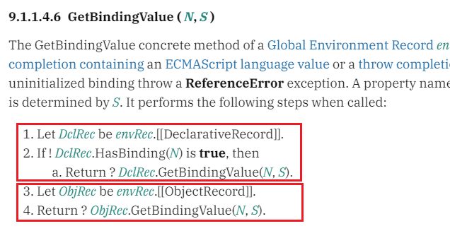
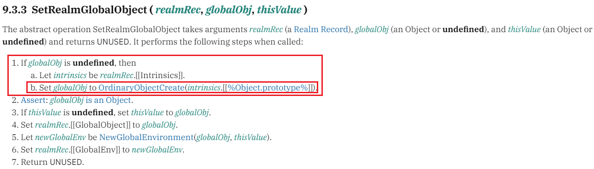
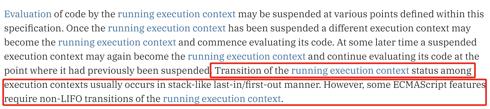

# 执行上下文

## 引言

执行上下文描述了当前代码执行的情况，了解执行上下文对于理解JavaScript的运行原理至关重要。

```js
function func() {
  if (true) {
    let a = 1
  }
  console.log(a)
}
func()
```

对于上面这段代码，绝大多数的人知道会报错，可是：为什么会报错呢？

如果将代码改造为：

```js
function func() {
  if (true) {
    var a = 1
  }
  console.log(a)
}
func()
```

还是有很多人知道会打印 `1` ，甚至会搬出 **变量提升** 这样的专业术语，可是：变量提升的底层原理究竟是什么？

再改造一下代码：

```js
function func() {
  if (true) {
    a = 1
  }
  console.log(a)
}
func()
```

还是会有人知道会打印 `1` ，少数人可能知道 `window` 对象下新增了一个名为 `a` 值为 `1` 的属性，可是：为什么会发生这样奇特的现象呢？

总之，你需要真正理解JavaScript的执行原理，了解每一行代码在引擎中究竟发生了什么。这可以帮助你重新思考以前觉得习以为常的事实，打破以往只知结果不晓原因的常态，在JavaScript学习的路上，重新出发。


JavaScript的运行原理是非常复杂的，有诸多关联概念，在开始学习执行上下文之前，需要充分理解以下概念：

- Environment Records：环境记录，描述当前词法环境，理解作用域、作用域链、变量提升、`this` 的关键
- Realms：领域对象，JavaScript的顶级对象，理解全局环境的关键

以下将先从依赖概念开始讲起，使用案例尽可能将概念讲述清楚，如有不正之处，还望读者慷慨指出！

## Environment Records

**环境记录与词法作用域息息相关** ，先看看ES规范中是怎么介绍它的：

> Environment Record is a specification type used to define the association of Identifiers to specific variables and functions, based upon the lexical nesting structure of ECMAScript code. Usually an Environment Record is associated with some specific syntactic structure of ECMAScript code such as a FunctionDeclaration, a BlockStatement, or a Catch clause of a TryStatement. Each time such code is evaluated, a new Environment Record is created to record the identifier bindings that are created by that code.

环境记录通过代码中的嵌套结构来定义标识符与特定变量、函数的关联关系，一般来说，环境记录会在 **函数定义、块定义、catch子句** 开启时创建。


```js
function func(a) { // A区块
  if (a) { // B区块
    conosle.log(a)
  }
}
```

以上代码，创建了两个环境记录对象，一个从A区块开始时创建，一个在B区块开始时创建。 这两个环境记录的类型是不同的，后面会提到。

从这个例子可以简单认为： **每个词法作用域都对应了一个环境记录** 。

ES规范中，将环境记录分为5种，其中大类分3种，它们的关系如下：

- Declarative Environment Records：声明性环境记录，用于存储变量、函数、类、模块的声明
   - Function Environment Records：函数环境记录，声明性环境记录的子类，从函数定义的位置开始创建，与声明性环境记录明显的差别是存在 `this` 绑定
   - Module Environment Records：模块环境记录，声明性环境记录的子类，从模块定义的位置开始创建，其内部维护了引入的依赖列表
- Object Environment Records：对象环境记录，如果当前区块通过 `with` 创建，则创建了一个对象环境记录
- Global Environment Records：全局环境记录，它是一个对象环境记录与声明性环境记录的复合体，一般而言是单例的

### 链

此外，每个环境记录对象都有一个 `[[OuterEnv]]` 属性，用来访问其上层环境记录，这其实就是 **作用域链** 的工作原理。参考以下代码：

```js
function func(a) { // A
  if (a) { // B
    let b = 1
    console.log(a + b)
  }
}

func(1)
```

上述代码在A处与B处分别创建了两个环境记录，使用代码表示类似于：

```ts
const a: FunctionEnvironmentRecord = {
  [[OuterEnv]]: null,
  a: 1
}
const b: DeclarativeEnvironmentRecord = {
  [[OuterEnv]]: a,
  b: 1
}
```

> 为了简化概念，这里视函数环境记录 `a` 的外层环境记录为空，但其实不是空，应该是全局环境记录。

当代码执行到 `console.log(a + b)` 这一行时，js引擎会尝试获取变量 `a` 的值，于是在当前的环境记录（B）中查找 `a` ，没有找到，于是继续沿着 `[[OuterEnv]]` 往上查找，在找到环境记录A时发现了变量 `a` 。这就是作用域链中变量查找的原理。

### Declarative Environment Records

```js
if (true) { // A
  const a = 1
  function inner() { // B
    console.log(a)
  }
  class Person { // C
  }
  const p = new Peson()

  if (a) { // D
    const x = 2
    console.log(x)
  }
}
```

以上代码中，从A处开始创建了第一个声明性环境记录：

```ts
const er: DeclarativeEnvironmentRecord = {
  [[OuterEnv]]: null,
  a: 1,
  inner: ?,
  Person: ?,
  p: ?,
} 
```


接着，在D处创建了第二个声明性环境记录：

```ts
const er2: DeclarativeEnvironmentRecord = {
  [[OuterEnv]]: er,
  x: 2,
}
```


### Function Environment Records

相比声明性环境记录，函数环境记录有一些特殊的属性：

| 属性 | 可选值 | 描述 |
| -- | -- | -- |
| [[ThisValue]] | 任意值，如果是基本数据类型，将装箱为对象 | 函数绑定的 `this` 值 |
| [[ThisBindingStatus]] | lexical/initialized/uninitialized | `this` 绑定状态，如果是箭头函数，为lexical |
| [[FunctionObject]] | 对象 | 当前运行的函数对象自身 |
| [[NewTarget]] | 一个对象或null | 如果当前函数通过构造函数调用，该属性有值，否则为空 |

```js
function func(a) { // A
  let b = 1
  console.log(a + b)
}

func(1)
```

如上代码，从A处开始将创建一个函数环境记录：

```ts
const fer: FunctionEnvironmentRecord = {
  [[OuterEnv]]: null,
  [[ThisValue]]: {}, // window
  [[ThisValueStatus]]: 'initialized',
  a: 1,
  b: 1,
}
```

与声明性环境记录不同的是，函数环境记录会绑定 `this` 。上面的例子中，函数 `func` 通过普通方式调用，因此其 `this` 是全局 `window` 对象。

如果函数是一个箭头函数：

```js
const func = (a) => { // A
  let b = 1
  console.log(a + b)
}

func(1)
```

此时，环境记录会有一些差异：

```ts
const fer: FunctionEnvironmentRecord = {
  [[OuterEnv]]: null,
  [[ThisValue]]: null,
  [[ThisValueStatus]]: 'lexical',
  a: 1,
  b: 1,
}
```

**箭头函数的 `this` 绑定状态永远为 `lexical` ，这意味着，箭头函数是不存在 `this` 绑定的。** 因此，当在箭头函数中使用 `this` 时，由于箭头函数的环境记录没有 `this` 绑定，因此会通过 `[[OuterEnv]]` 继续向上查找，直到查找到存在 `this` 绑定的环境记录。这是为什么常说箭头函数的 `this` 是词法的原理。


### Object Environment Records

一般来说，我们通过 `with` 语法来开启对象环境记录。参考以下代码：

```js
const o = {
  a: 1,
}
with (o) { // A
  a = 2
}

console.log(o.a) // 2
```

为什么在A处的代码中，可以通过 `a = 2` 的方式对对象 `o` 进行修改呢？这要从对象环境记录的值绑定规则说起：

**在对象环境记录中，所有的变量绑定发生在被绑定的对象中** ，如上例中， `a = 2` 等同于 `o.a = 2` 。

因为全局的环境记录本身至少是一个对象环境记录，所以解释以下代码也就不难了：

```js
a = 1

console.log(window.a) // 1
```

你可以理解为，全局范围就像在一个大的 `with` 语句包含下：

```js
with (window) {
  a = 1
  console.log(window.a) // 1
}
```

### Global Environment Records

**全局环境记录是一个复合环境记录** ，其内部持有了一个对象环境记录和一个声明性环境记录，其中：

**对象环境记录用于存储通过 `function` 、`var` 声明的函数、变量** ，如以下代码：

```js
var a = 1
function test() {
  console.log('test')
}

window.test() // test
console.log(window.a) // 1
```

但是通过 `const/let` 声明的变量不会存储在对象环境记录中，因此不会在 `global object` 中添加新的属性：

```js
const x = 1
console.log(x) // undefined
```

而除了通过 `function/var` 声明的函数/变量外，其他声明都存储在声明性环境记录中，因此在上述代码中，变量 `x` 存储在声明性环境记录中。

那么，全局环境记录是如何存储复合的环境记录的呢？在全局环境记录中，有以下特殊的属性:

| 属性 | 可选值 | 描述 |
| -- | -- | -- |
| [[ObjectRecord]] | 对象环境记录对象 | 一个绑定了全局对象的对象环境记录 |
| [[GlobalThisValue]] | 一个对象 | 全局 `this` 值 |
| [[DeclarativeRecord]] | 声明性环境记录对象 | 除了对象环境记录中的声明，其他声明记录在这个对象中 |
| [[VarNames]] | 一个string集合 | 这个集合记录了在全局代码中绑定在对象环境记录中的声明名称，以跟全局对象中默认的声明区分 |

## Realms

先看看ES规范中对Realms的介绍：

> Before it is evaluated, all ECMAScript code must be associated with a realm. Conceptually, a realm consists of a set of intrinsic objects, an ECMAScript global environment, all of the ECMAScript code that is loaded within the scope of that global environment, and other associated state and resources

在运行之前，所有代码都必须与一个Realm进行关联。一个Realm包含了内置对象、全局环境、在当前全局环境下加载的代码以及一些关联状态和资源。

以下是一个Realm Rcord对象所拥有的字段信息：

| 属性 | 可选值 | 描述 |
| - | - | - |
| [[Intrinsics]] || 存储所有内置对象 |
| [[GlobalObject]] | 对象或undefined | 绑定的全局对象 |
| [[GlobalEnv]] | 一个GlobalEnvironmentRecord对象 | 全局环境记录 |
| [[TemplateMap]] ||  |
| [[HostDefined]] | 任意值 | 自定义 |

简单理解，**Realm是代码运行的全局环境** ，考虑以下代码：

```js
function func() {
  const arr = new Array()
  arr.push(1)
}

func()
```

当代码运行至 `const arr = new Array()` 时，为什么能正确找到 `Array` 这个构造函数呢？这背后发生了什么？让我们简单梳理一下：

1. 当函数 `func` 开始执行时，一个函数类型的环境记录被创建；
2. 代码执行至 `const arr = new Array()` 时，在当前函数环境记录中查找 `Array` ，没有找到；
3. 继续查找当前环境记录的 `[[OuterEnv]]` ， 找到全局环境记录；
4. 在全局环境记录中，先从声明性环境记录中查找，没有找到；
5. 接着从对象环境记录中查找，在其绑定的对象global object中找到了 `Array` 构造函数


关于全局环境记录的查找规则，在规范中有指出：



之所以在global object中能找到 `Array` ，是因为全局对象的创建来自于 Realm Record 中的 `[[Intrinsics]]` 对象，在规范中可以找到佐证：



### 隔离性

Realms最值得称道的是它的隔离性，以浏览器为例，每一个窗口、tab页、iframe有不同的全局Realm，这样可以保证各个窗口的数据不会互相干扰，从而起到隔离的作用。你也可以称其为：沙箱。

考虑以下代码：

```js
const arr = new Array()

const iframe = document.createElement('iframe')
document.body.appendChild(iframe)

console.log(arr instanceof iframe.contentWindow.Array) // false
```

因为Realm不同，因此其关联的global object也不同，在对引用类型的数据进行比较时，无法得到预期的结果。这也就是为什么使用 `instanceof` 判断是否是数组不是首选方案的原因了。

而使用这种方式进行判断，对原始数据类型进行比较，就显得安全了很多：

```js
const arr = new Array()

const iframe = document.createElement('iframe')
document.body.appendChild(iframe)

console.log(iframe.contentWindow.Object.prototype.toString.call(arr) === '[object Array]') // true
```

## 执行上下文

说了那么多，终于要到我们的主角登场了：执行上下文。

不管是网上的文档、文章，还是频繁出现的面试题，总给执行上下文披上了一层神秘的面纱，仿佛执行上下文是一个高深莫测的概念。但在我们的文章里，对它的介绍并不会很多，因为很多的东西，在此之前你都已经学过了。

本文中，只探讨三个问题:

1. 什么是执行上下文？
2. 执行上下文包含哪些部分？每个部分起什么作用？
3. 执行上下文何时创建？如何运作？

### 什么是执行上下文？

简单解释一下什么是上下文：

以大家上课为例，在上课时，你是执行上课这件事的当事人。那么，作为上课的人，你要完成上课这件事，需要什么上下文呢？

首先，你需要课本，如果没有课本，你将无法对老师讲的内容进行阅读与记录；然后，你需要一个讲课的老师；最后，其实学校的铃声也是你的上下文，有了它，你才知道什么时候该结束上课。

这些都是你上课的上下文，当然不仅限于这些，你可以发掘更多的上下文资源，如课桌、同学、课程表等等。总之，**上下文是做某件事需要的资源、原料，或者说，上下文是执行某件事的环境。**

```js
console.log(1)
```

这是一行简单的代码，要想打印出 `1` 这个数字，JavaScript引擎首先需要获取到 `console` 对象，然后从这个对象中查找一个名为 `log` 的函数，并调用它，传递参数 `1` ，整个过程才算结束。

可是，JavaScript引擎为何能获取到 `console` 这个对象呢？接着阅读吧！


### 上下文的内容

一个上下文对象包含以下组件，当我列出它们时，你一定感觉很熟悉：

| 组件 | 作用 |
| -- | -- |
| code evaluation state | 代码运行状态，用于控制代码的启停 |
| Function | 如果当前代码是通过一个函数运行的，则指向正在运行的函数对象本身 |
| Realm | 全局的Realm Record对象，global object就存储在这里 |
| ScriptOrModule | 当前运行的script脚本或模块 |
| LexicalEnvironment | 词法环境，一个一个的Environment Record对象，共同构成了词法环境作用域链 |
| VariableEnvironment | 变量环境，Environment Record对象， 通过 `var` 声明的变量将会存储在这里 |
| PrivateEnvironment | 私有环境，通过 `class` 定义的私有类将会存储在这里 |

让我们用一个简单的例子，将上下文的组件串联起来理解：

```js
function func() {
  const a = 1
  console.log(a + b) // NaN
  var b = 1
}

func()
```

1. 当代码运行到 `func()` 处时，一个 **函数执行上下文被创建** ，函数被推入执行栈，该函数的执行上下文成为运行执行上下文；
2. 执行上下文的 `Function` 组件指向正在运行的 `func` 函数本身；
3. 执行上下文的 `ScriptOrModule` 组件指向当前执行的JavaScript脚本或模块；
4. 当代码执行至 `const a = 1` ，`LexicalEnvironment` 组件收集到第一个变量定义（在函数开始执行时，已创建函数环境记录对象）；
5. 当代码运行到 `console.log(a + b)` 处时，`LexicalEnvironment` 组件从当前环境记录中查找名为 `console` 的变量，没有找到，继续从 `[[OuterEnv]]` 中查找，最终找到全局环境记录，在global object中找到了 `console` 对象；
6. 接下来寻找变量 `a` 与 `b` ，由于 `a` 在当前环境记录中存储了，很快找到了； 变量 `b` 由于 **声明提升** 被 `VariableEnvironment` 组件收集并被初始化为 `undefined` ，因此， `a + b` 运算得到 `NaN` ；
7. `console.log` 函数运行，该函数被推入执行栈，`func` 函数暂停；
8. 代码运行至 `var b = 1` 时，`VariableEnvironment` 组件为 `b` 赋值为 `1`；
9. 函数执行结束，函数被弹出执行栈，执行上下文销毁。

### 上下文的运作机制

在上一小节中，其实已经剧透了部分上下文的运作机制。其实，在很多编程语言中，都会设计 **调用栈** 这个数据结构，栈的结构对于函数的交替调用非常适用。

考虑以下代码：

```js
function outer() {
  const a = 1
  function inner() {
    const b = 1
    console.log(a + b)
  }
  inner()
  console.log(a)
}

outer()
```

JavaScript引擎会在全局执行以上代码，全局代码的执行也需要上下文环境，因此：

**全局代码运行会创建全局执行上下文** 。

> 很多文章中会提到上下文的两大经典分类：全局执行上下文与函数执行上下文，其实在我个人看来，区分它们的意义不大，因为全局的执行上下文相较于函数执行上下文，无非就是 `Function` 组件指向空而已，其他该有的组件都是正常的。
>
> 其实我们也可以简单理解为：全局的代码被包裹在一个函数中运行。

在这个例子中，执行上下文是这样交替运作的：

1. 当全局代码执行到 `outer()` 处时，一个新的执行上下文被压入调用栈，此时栈顶的执行上下文是 `outer` 函数的上下文；
2. 当 `outer` 函数的代码执行到 `inner()` 处时， `outer` 函数暂停，`inner` 函数被压入调用栈，此时栈顶的执行上下文是 `inner` 函数的执行上下文；
3. 当 `inner` 函数执行完毕时，`inner` 函数的执行上下文出栈，栈顶的上下文重新变成 `outer` 函数的执行上下文；
4. 当 `outer` 函数执行完毕时，`outer` 函数的执行上下文出栈，栈顶的上下文重新变成全局执行上下文；
5. 全局代码执行完毕时，全局执行上下文也出栈，整个脚本的代码运行结束了。

在规范中，描述了执行上下文状态切换所使用的数据结构：



> 话说还有不是栈结构的？读者有懂的可指教一下。

## 细说函数执行上下文

经过上面的学习，我们已经知道了如下事实：

- JavaScript代码的执行依赖于执行栈的调度；
- 执行上下文在代码运行时创建（如全局代码运行时、函数运行时）。

```js
function func() { // A
  if (true) { // B
    var a = 2
    let b = 1
  }
  console.log(a) // 2
  console.log(b) // ReferenceError: b is not defined
}
func()
```

<!-- 本章节中，我们只讨论上述代码的 -->


## 练习


```js
function func() {
  console.log(a)
  console.log(b)
  if (true) {
    var a = 1
    let b = 2
  }
}

```


```js
a = 1
var b = 2
let c = 3

console.log(window.a)
console.log(window.b)
console.log(window.c)
```

```js
function func() {
  a = 1
}
func()
console.log(window.a)
```


```js
function hello() {
  console.log(this)
}

hello()
```


```js
function hello() {
  const inner = () => {
    console.log(this)
  }
  inner()
}

hello()
```