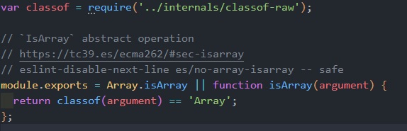

# 数组

## 检测

### 原型链视角

只要在当前对象的原型链中，找到了 `Array.prototype` ，就说明该对象是数组（至少它可以调用数组原型上的所有方法）。

所以，最简单的检测数组的方法是：

```js
const arr = [1, 2, 3]
arr instanceof Array // true
```

需要注意的是，`arr instanceof Array` 的语义不是 **`arr` 由 `Array` 构造函数构造而来** ！而是在 `arr` 的原型链中查找，直到找到 `Array.prototype` 即为 `true` ，与构造函数没有任何关系！不妨看看下方的代码：

```js
const o = Object.create(Array.prototype)
o instanceof Array // true
```

很显然，对象 `o` 不是一个数组，但是判断时却返回了 `true` 。因此，这种判断方法个人认为从合理性上分析就不够充分，何况它还有一个很严重的坑。

::: danger 坑
众所周知，iframe拥有自身的 `window` 对象，如果在主 `window` 中创建一个数组：

```js
window.arr = [1, 2, 3]
```

在iframe中，拿到此数组对象进行类型判断：

```js
window.parent.arr instanceof Array // false
```

为什么？因为主窗口与iframe拥有独立的 `window` ，因此 `window.Array` 也是独立的，继而 `window.Array.prototype` 也是独立的，两个对象不在同一块内存空间，因此判断相等时，当然为 `false` 。
:::

### Object.prototype.toString

在JavaScript中，每个对象都有一个 `[[class]]` 属性，通过调用 `Object` 原型上的 `toString` 方法可得：

```js
function isArray(arr) {
  return Object.prototype.toString.call(arr) === '[object Array]'
}
```

::: tip
之所以使用 `Object.prototype.toString.call()` 这种写法，而不是 `arr.toString()` ，是因为自定义对象可能覆盖自身的 `toString` 方法，从而得不到预期值。例如数组 `[1, 2, 3]` 调用 `toString` 后的结果是 `'1,2,3'` ，而不是 `'[object Array]'`。
:::

### Array.isArray

ES6以后新增了 `isArray` API，可以非常简单、准确地检测数组。

```js
const arr = [1, 2, 3]
Array.isArray(arr) // true
```

::: tip ES6之前数组类型是怎么判断的呢？
在 `core-js` 库的 `packages\core-js\internals\is-array.js` 中找到 `Array.isArray` 的polyfill，原来也是调用了 `Object.prototype.toString` 方法：


:::

::: details ES6规范中关于判断数组的细则：
1. 如果参数不是对象类型，则返回false
2. 如果参数是数组特异对象，返回true
3. 如果是Proxy代理对象，则递归调用其所代理的对象进行判断
4. 返回false

具体参见：[https://tc39.es/ecma262/#sec-isarray](https://tc39.es/ecma262/#sec-isarray)
:::

## 迭代

<Todo />

## 稀疏数组

```javascript
const arr = []
arr[1] = 1
arr[50] = undefined
arr[100] = 100
```
arr即为一个稀疏数组，稀疏数组的特点：

* for...of循环会按照length的长度迭代
* forEach/map/reduce等迭代api会忽略空缺的位置

## indexOf缺陷


```javascript
const arr = [1, NaN, 3]
console.log(arr.indexOf(NaN)) // -1
```
`indexOf`内部使用`===`进行比较，因为NaN不等于NaN，所以会找不到。

## 类数组

<Todo />

## 手写系列

### 手写数组所有原型方法


::: code-group

```js [forEach]
function forEach(arr, callback) {
  for (let i = 0, len = arr.length;i < len;i++) {
    callback(arr[i], i, arr)
  }
}
```

```js [map]
function map(arr, callback) {
  const newArr = []
  for (let i = 0, len = arr.length;i < len;i++) {
    newArr.push(callback(arr[i], i, arr))
  }
  return newArr
}
```

```js [filter]
function filter(arr, callback) {
  const newArr = []
  for (let i = 0, len = arr.length;i < len;i++) {
    if (callback(arr[i], i, arr)) {
      newArr.push(arr[i])
    }
  }
  return newArr
}
```


```js [some]
function some(arr, callback) {
  for (let i = 0, len = arr.length;i < len;i++) {
    if (callback(arr[i])) return true
  }
  return false
}
```

```js [every]
function every(arr, callback) {
  for (let i = 0, len = arr.length;i < len;i++) {
    const pass = callback(arr[i])
    if (!pass) return false
  }
  return true
}
```

```js [find]
function find(arr, callback) {
  for (let i = 0, len = arr.length;i < len;i++) {
    if (callback(arr[i])) return arr[i]
  }
}
```

```js [findIndex]
function findIndex(arr, callback) {
  for (let i = 0, len = arr.length;i < len;i++) {
    if (callback(arr[i])) return i
  }
  return -1
}
```

```js [indexOf]
function indexOf(arr, item) {
  for (let i = 0, len = arr.length;i < len;i++) {
    if (arr[i] === item) return i
  }
  return -1
}
```

:::

