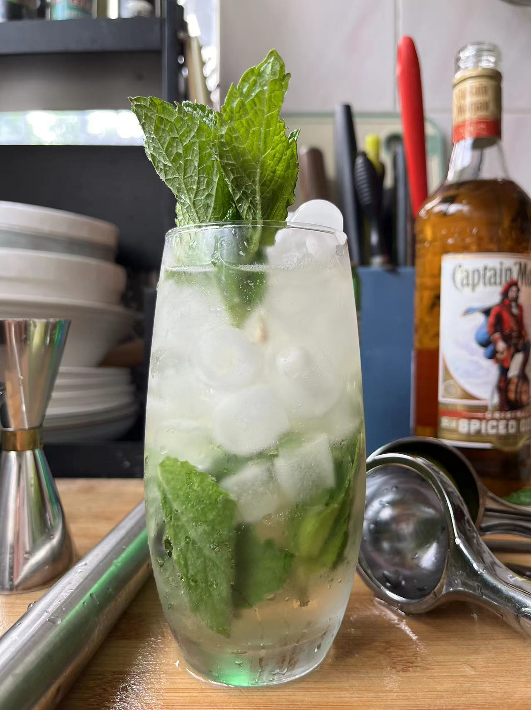

# Mojito制作流程

## 第一步：准备工具、材料

准备以下工具与材料：

- 朗姆酒
- 小青柠
- 薄荷叶
- 冰块
- 气泡水
- 糖（糖浆）

## 第二步：调制

1. 切柠檬。将柠檬对半切开，取其中一半，切为4块，将这4块放入杯中
2. 捣烂柠檬。使用碎冰锤按压，按压的力度应适中（既能将柠檬汁挤出，又不至于将柠檬皮挤烂而使得汁水发苦，此为最佳力道）
3. 放薄荷叶。 取若干薄荷叶，在另一只手上（或在案板上）拍打，拍打出薄荷叶的香气，然后放入杯中
4. 倒酒。倒入15 ~ 30ML的白朗姆（也可以使用金朗姆）
5. 放碎冰。在杯中放入适量碎冰
6. 放糖。放入适量的糖（或糖浆）
7. 倒气泡水。将气泡水倒入杯中
8. 加柠檬汁。将剩下的一半柠檬，挤压出汁入杯
9. 搅拌。搅拌4-6圈，将气泡水中的气泡搅拌出来，并使得原料充分混合
10. 加冰。加入更多冰块
11. 放薄荷叶。使用薄荷叶在杯沿擦拭，并将其插入冰块中，作为装饰

## 成果分享

