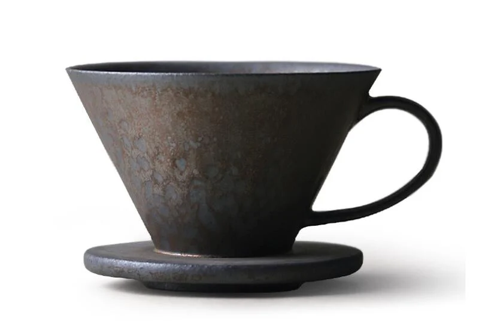
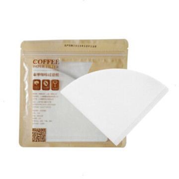
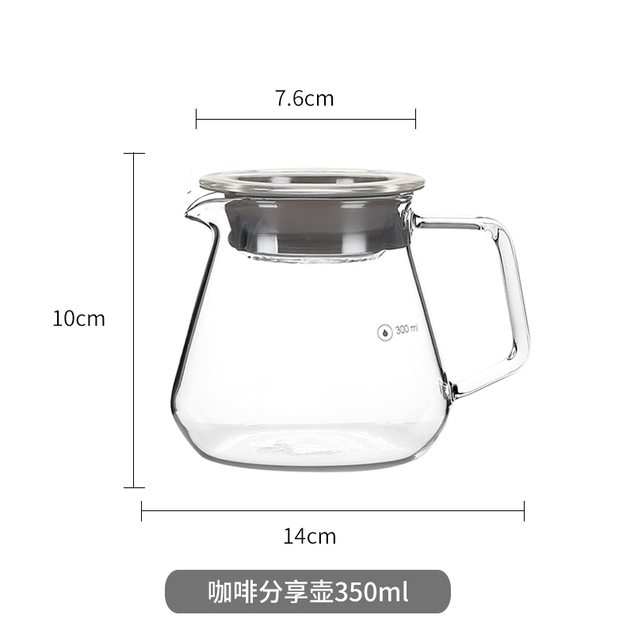
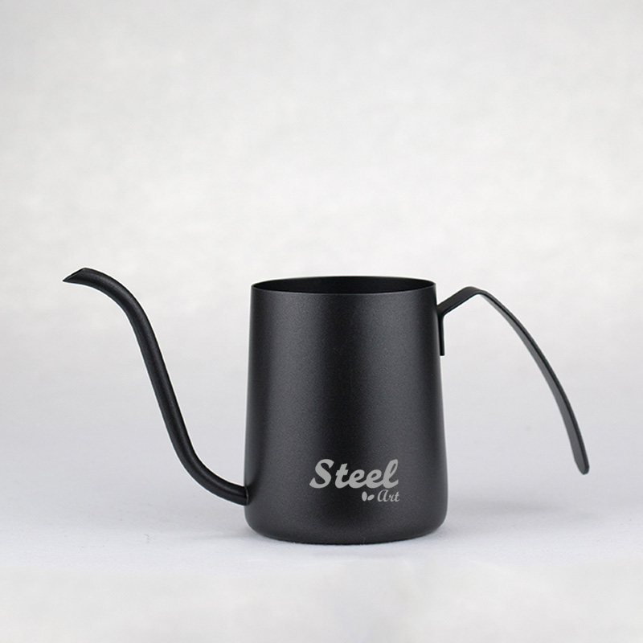
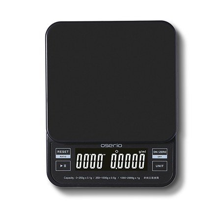
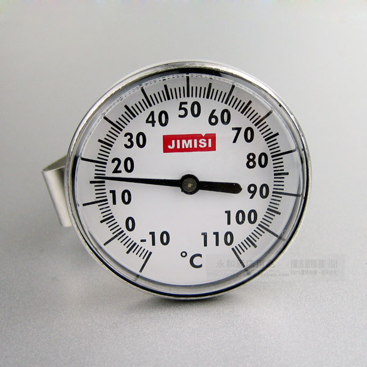

# 手磨咖啡入门

## 前置工作：准备工具

首先，你需要准备以下工具：

| 工具 | 作用 | 图片 | 备注 |
| -- |-- | --| -- | 
| 咖啡罐 | 装咖啡豆 |  | 准备一月的量即可 |
| 手磨机 | 磨咖啡粉 |  | 粗细可调节 |
| 滤杯 | 过滤咖啡 |  | - |
| 滤纸 | 过滤咖啡 |  | 滤纸大小应与滤杯匹配 |
| 分享壶 | 盛过滤后的咖啡液 |  | - |
| 手冲壶 | 盛水 |  | - |
| 咖啡秤 | 称量咖啡、水，控制粉水比 |  | - |
| 温度计 | 计量手冲壶水温 |  | - |

## 第一步：磨咖啡粉、烧水

接下来，我们开始手冲咖啡的第一步，首先需要磨粉，你可以按照以下步骤来：

1. 取出咖啡秤
2. 取出咖啡豆罐，根据需要量取一定的咖啡豆
3. 记住咖啡豆的重量，以备后续使用
4. 将咖啡豆放入手磨机，开始磨粉

磨粉之前，可以先把开水煮上。

## 第二步：清洗滤纸、滤杯、分享壶

1. 取出滤纸
2. 将滤纸置于滤杯上
3. 使用手冲壶在滤纸上均匀画圈，全部浸湿滤纸
4. 将分享壶内的水摇晃一下，倒掉

::: tip
不管是泡咖啡还是泡茶、调酒，都需要注意清洗部件，清晰滤纸可以将滤纸表面可能的尘土洗掉，还可以洗去滤纸的木浆味。
:::

## 第三步：冲咖啡

接下来，就是正式冲咖啡了。你可以按照这个步骤来：

1. 将磨好的咖啡粉倒入滤纸内
2. 确保手冲壶的水在85度左右，这样冲出的咖啡会更好喝
3. 使用手冲壶由内向外均匀画圈，将咖啡浸湿时，停止
4. 闷蒸20秒
5. 按照第3步，继续冲水
6. 保持粉水比在1:10到1:16之间，如果喜欢浓的，就少冲点水

## 第四步：品尝

将冲好的咖啡从分享壶中倒出，开始品尝吧！

