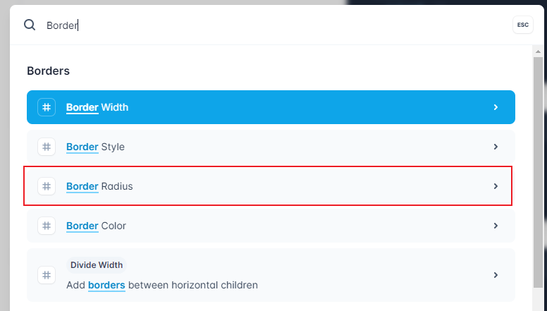

- 安装
- 开始使用
- 自定义class的应用
- 没有需要的变量？
- 响应式
- 暗黑模式
- 放弃Sass/Less/Stylus等预编译器
- 在style中使用Tailwind变量
- 覆盖TailwindCSS配置
- 使用插件快速解决问题
   - 比例盒子插件
   - 多行文本溢出插件

<!-- [[toc]] -->

## 安装

以下方法是`Vite + Vue`模式下的安装方法，其他脚手架与框架的使用同理。

**创建项目**

```bash
pnpm create vite app --template vue
# yarn create vite app --template vue
# npm create vite app --template vue
```

**安装必要依赖**

Vite创建的项目默认集成了`PostCSS`，而`TailwindCSS`本身就是一个`PostCSS`插件，所以直接使用即可。

```bash
pnpm i -D tailwindcss postcss autoprefixer
# yarn add -D tailwindcss postcss autoprefixer
# npm i -D tailwindcss postcss autoprefixer
```

**创建TailwindCSS配置文件**

使用`tailwindcss`的初始化命令创建会更快：

```bash
npx tailwindcss init -p
```

这一步会做两件事：
1. 创建`postcss.config.js`文件，这里的配置主要是添加`tailwindcss`的插件，这样你编写的css才会被`tailwindcss`处理；
2. 创建`tailwind.config.js`文件，主要进行扫描规则、主题、插件等配置。

为了打包时TailwindCSS能生成对应的样式文件，需要在`tailwind.config.js`中正确配置`content`字段，如以下配置将扫描 `src` 目录下所有以 `vue/js/ts/jsx/tsx` 结尾的文件。

```js
/** @type {import('tailwindcss').Config} */
module.exports = {
  content: [
    './src/**/*.{vue,js,ts,jsx,tsx}'
  ],
  theme: {
    extend: {},
  },
  plugins: [],
}
```


::: warning 注意
TailwindCSS并不会生成一个全量的样式包，而是根据具体使用到的语法生成对应的样式代码，这样可以确保打包产生的样式包是最小的。

参考这篇文章：[https://tailwindcss.com/docs/content-configuration](https://tailwindcss.com/docs/content-configuration)
:::

**引入Tailwind的基本指令**

`tailwind.css`
```css
@tailwind base;
@tailwind components;
@tailwind utilities;
```

`main.js`
```js
import './tailwind.css'
```

## 开始使用

现在，你可以开始使用TailwindCSS的语法了：

```vue
<template>
  <div class="w-32 h-32 bg-blue-500">
  </div>
</template>

```

如上语法，你将在页面看到一个正方形的蓝色盒子：

<div class="w-32 h-32 bg-blue-500" />


::: details TailwindCSS语法检索技巧
TailwindCSS的基本原则是将每一个style语法转换为一个class，因此，在官网检索想要的样式class时，**按照样式的语法来检索是效率最高的**。如想要获取圆角的语法，只需要搜索`Border Radius`即可：


:::

## 怎么在自定义class中使用Tailwind语法？

有时候，你可能会因为重复的元素而不得不自定义一个class，如：

```html
<div class="p-2 text-gray-900 font-semibold">首页</div>
<div class="p-2 text-gray-900 font-semibold">学习TailwindCSS</div>
<div class="p-2 text-gray-900 font-semibold">TailwindCSS的设计哲学</div>
<div class="p-2 text-gray-900 font-semibold">最佳实践</div>
```

以上写法不仅在开发时会造成重复的困扰，也不利于维护，此时我们会希望给每个元素一个class，像这样：

```html
<div class="menu">首页</div>
<div class="menu">学习TailwindCSS</div>
<div class="menu">TailwindCSS的设计哲学</div>
<div class="menu">最佳实践</div>
```

现在问题来了，在为`menu`定制样式时，我们该怎样使用TailwindCSS语法呢？

TailwindCSS提供了`@apply`语法，这种语法的使用手感与在html模板中使用是一样的：

```css
.menu {
  @apply p-2 text-gray-900 font-semibold;
}
```


::: warning 注意
1. 尽管使用`@apply`语法可以解决样式复用的问题，但并不推荐在早期就进行抽象，**因为自定义class的做法会生成更多的样式代码，造成生成的css文件变得更大**。

2. 还有一个理由可以证明不使用自定义class会更好：你完全可以通过循环的语法来解决此问题：
```vue
<template>
  <div
    v-for="menu in ['首页', '学习TailwindCSS', 'TailwindCSS的设计哲学', '最佳实践']"
    :key="menu"
    class="p-2 text-gray-900 font-semibold">{{{ menu }}}</div>
</template>
```
这样未来维护时，不仅样式的修改变得更加容易，内容区也会变得更好维护。


关于样式复用的更多信息，可参考：[https://tailwindcss.com/docs/reusing-styles](https://tailwindcss.com/docs/reusing-styles)
:::


::: tip 
如果进行的是组件级别的抽象，并且有需要让他人覆盖class的场景，则必须使用自定义class的方案，别无他选。（推荐组件级别的class复用使用BEM的命名规范）
:::

## 在自定义样式中如何使用Tailwind的变量？

大多数情况下，我们完全可以组合使用Tailwind的原子化class来解决问题。但如果就是要使用自定义的样式代码，我们该如何使用到Tailwind配置中定义的变量呢？

比如下面的代码中，希望为某个元素添加一个上边框，但是又想要使用到Tailwind配置中的`gray-200`颜色，该怎么办呢？

```css
div {
  border-top: 1px solid ?;
}
```

因为`TailwindCSS`本身是一个`PostCSS`插件，所以理论上任何有关`TailwindCSS`的配置信息都可以通过css的方式拿到。

`TailwindCSS`提供了一个`theme`函数，可以拿到`tailwind.config.js`中配置的`theme`的值：

```css
div {
  border-top: 1px solid theme('colors.gray.200');
}
```

以上代码最后会被编译为：

```css
div {
  border-top: 1px solid #e5e7eb;
}
```

::: warning 注意
`TailwindCSS`认为，所有不使用其变量的值都为魔法值。比如上方的代码，完全可以使用`1px solid #e5e7eb`来实现，但是未来如果要对颜色进行统一调整，这行代码将无法达到预期效果。

具体可参考文档：[https://tailwindcss.com/docs/functions-and-directives#theme](https://tailwindcss.com/docs/functions-and-directives#theme)
:::


## 全面且好用的响应式方案

在`TailwindCSS`中写响应式简直是福音，例如这个蓝色的盒子：


<div class="w-32 h-32 bg-green-500 md:bg-blue-500" />

```html
<div class="w-32 h-32 bg-blue-500" />
```

如果要想让其在`768px`以下的屏幕上显示为绿色，你需要这样：

```css
@media (max-width: 768) {
  div {
    @apply bg-green-500;
  }
}
```

而`TailwindCSS`只需要多加一点代码：

```html
<div class="w-32 h-32 bg-green-500 md:bg-blue-500" />
```

以上代码表示的含义是：默认显示绿色，在最小为`md(768px)`的屏幕下显示蓝色。

`TailwindCSS`响应式的规则为：

1. **`mobile first`**，即**手机端优先**，所有的样式都是考虑在手机端显示最佳