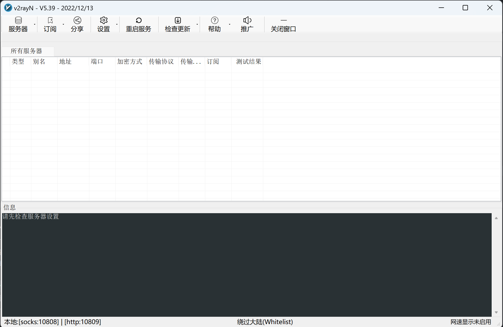
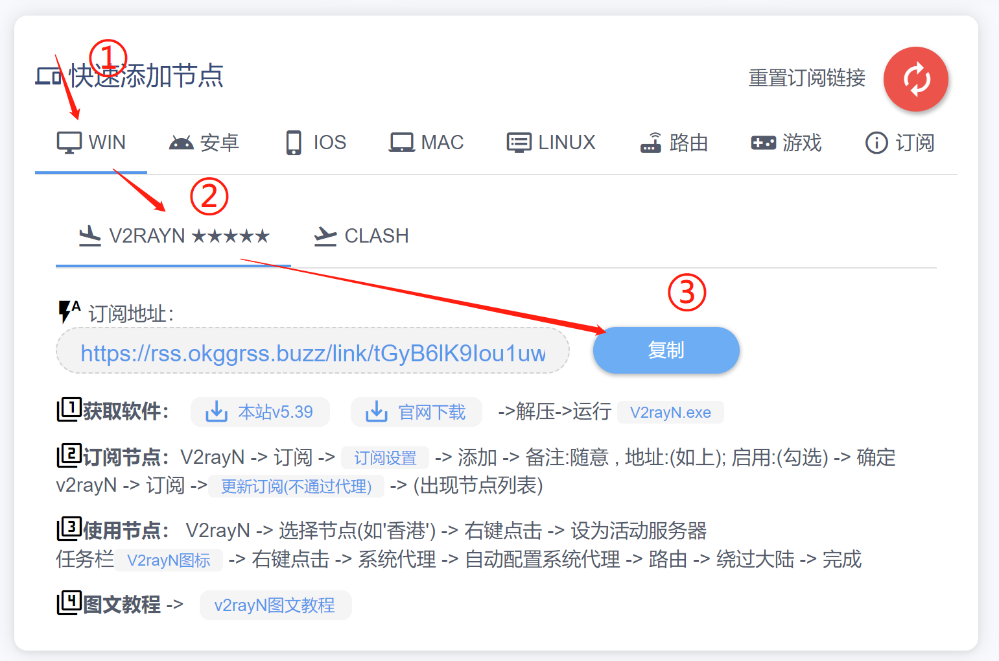
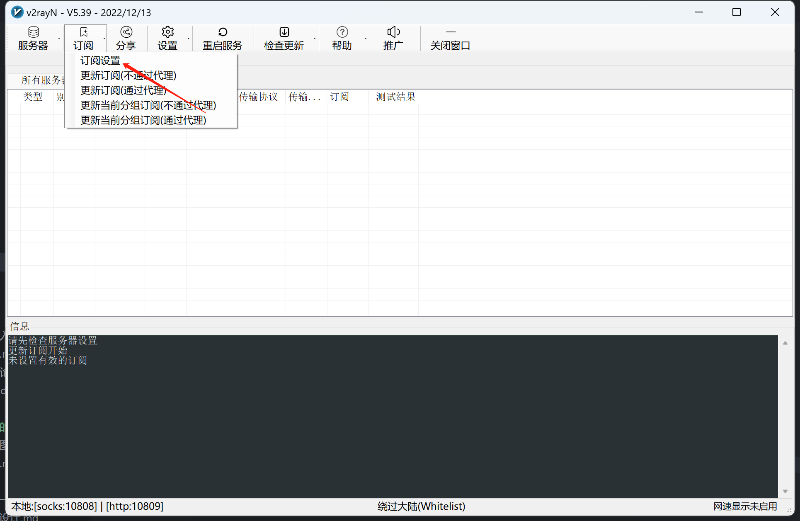
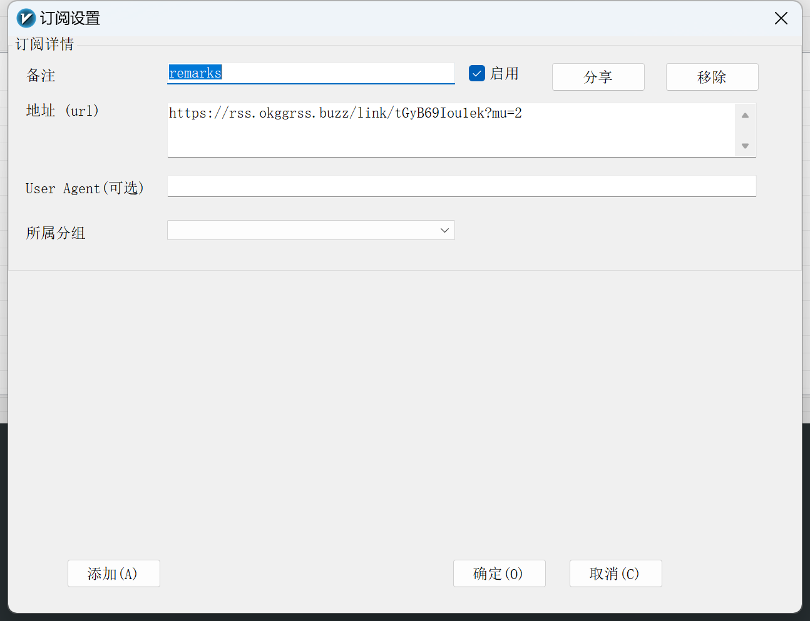
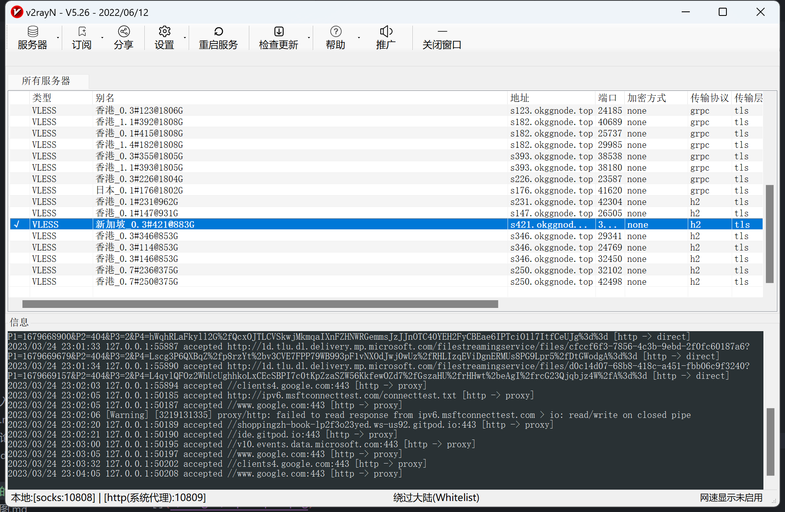
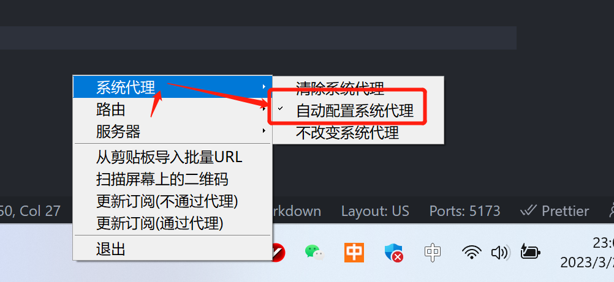

# 我奶奶都可以看的懂的翻墙教程

## 下载翻墙软件

[点击我](https://okgg.top/download/v2rayN-Core.zip)下载软件。

> 软件下载可能稍慢，属正常现象。如果下载失败，直接找我要。

## 运行软件

下载的是一个压缩包，将其解压出来，点击 **v2rayN.exe** 打开软件。

> 注：软件无需安装，直接使用即可。

软件界面：

## 获取订阅地址

第一步：打开以下链接

[https://okgg.top/](https://okgg.top/)

注册账号并登录，推荐码填写：**j0EJ**

第二步：在右侧菜单选择 **套餐购买**，根据自己的需求购买一个套餐。

> 如果想要试用效果，推荐购买比较便宜的套餐。

第三步：购买完成后，选择左侧菜单 **用户面板** ，切换到

复制专属订阅地址。

> 注：订阅地址不要随意分享给他人。

## 开始订阅

第一步：打开刚才的软件，点击 订阅 -> 订阅设置

第二步：点击添加，新增一个订阅

第三步：更新订阅地址

第四步：单击一个可用的节点，按下回车键选中（交互方式非常奇特，注意！）

第五步：找到右下角的V2vayN图标，右键选择菜单 **代理 -> 自动选择系统代理**

## 开始科学上网！

打开 [https://www.google.com/](https://www.google.com/) 。如果可以打开，则说明翻墙成功！