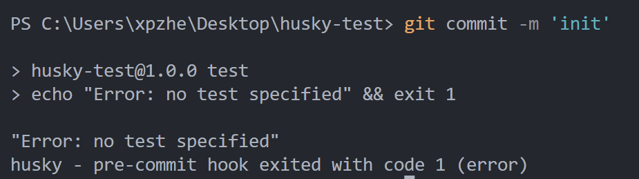

## 下载并初始化

首先，确保目录下存在`package.json`文件，并且该目录为一个git仓库。

然后，执行以下命令，初始化husky，并安装依赖。

```bash
npx husky-init && npm install       # npm
npx husky-init && yarn              # Yarn 1
yarn dlx husky-init --yarn2 && yarn # Yarn 2+
pnpm dlx husky-init && pnpm install # pnpm
```

初始化完成后，目录下会生成`.husky`目录：

```
|── husky
    |── _
        |── .gitignore
        |── husky.sh
    |── pre-commit
```

其中，`pre-commit`是husky自动创建的提交前钩子，其内容为：

```bash
#!/usr/bin/env sh
. "$(dirname -- "$0")/_/husky.sh"

npm test

```

当提交代码时将会执行`npm test`命令（由于该命令默认会打印一句话并退出，所以提交会发生错误而失败）：





