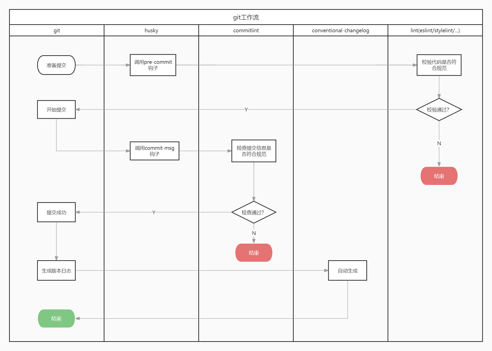
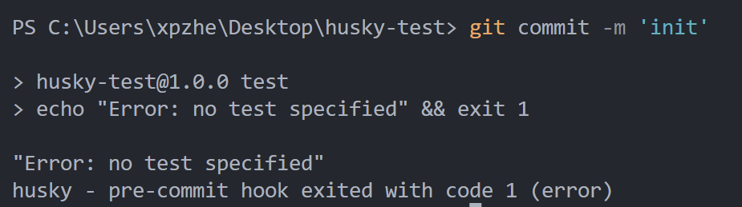
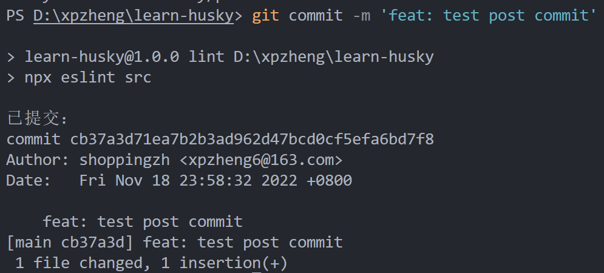
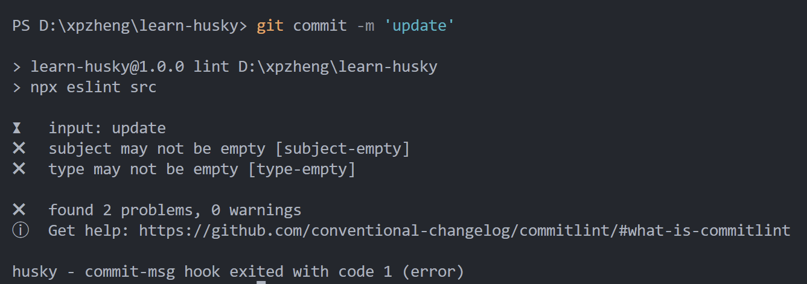
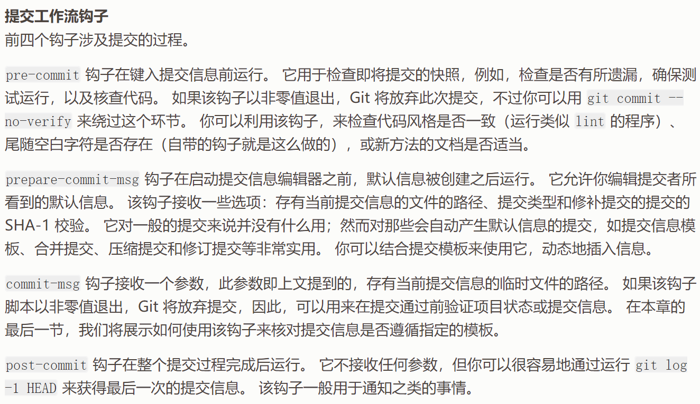

# git工作流



## husky入门

#### 下载并初始化

首先，确保目录下存在`package.json`文件，并且该目录为一个git仓库。

然后，执行以下命令，初始化husky，并安装依赖。

```bash
npx husky-init && npm install       # npm
npx husky-init && yarn              # Yarn 1
yarn dlx husky-init --yarn2 && yarn # Yarn 2+
pnpm dlx husky-init && pnpm install # pnpm
```

初始化完成后，目录下会生成`.husky`目录：

```
|── .husky
    |── _
        |── .gitignore
        |── husky.sh
    |── pre-commit
```

其中，`pre-commit`是husky自动创建的提交前钩子，其内容为：

```bash
#!/usr/bin/env sh
. "$(dirname -- "$0")/_/husky.sh"

npm test

```

当提交代码时将会执行`npm test`命令（由于该命令默认会打印一句话并退出，所以提交会发生错误而失败）：





#### 添加一个钩子


```bash
npx husky add .husky/post-commit 'echo "已提交：" & git log -1 HEAD'
```

以上命令会创建一个`post-commit`（提交后）的钩子，并打印提交的日志：




## 提交前：代码美化与校验

接下来，我们将通过 `husky` 添加一个 `pre-commit` 钩子，在提交代码前，通过Prettier美化代码和ESLint检查代码。

```bash
npx husky add .husky/pre-commit
```

然后，在 `.husky/pre-commit` 文件下编辑：

```bash
prettier --write src/**/*.{js,ts}
eslint src/**/*.{js,ts}
```

这样，每次提交时，会进行代码的美化和校验，如果代码不符合规范，将会提交失败。

::: danger 问题

这个方案乍看起来没什么问题，但是其实存在几个很明显的问题：

- 每次提交时，可能只提交了几个文件，但是都会对 `src` 下的所有js/ts文件进行校验，实属没必要；
- 不提交的代码不希望美化和校验，但是以上方案还是会继续美化和校验；
- 美化代码时会修改原代码，修改后的内容其实又回到了工作区，而不是在提交暂存区里。

:::

**使用lint-staged库解决问题**

[lint-staged](https://github.com/okonet/lint-staged) 可以完美解决以上问题，它的原理是寻找暂存区内的文件，并且只对这些文件（你可以通过glob表达式继续过滤）进行美化和校验。

举例说，你只准备提交 `src/1.js` 文件，`lint-staged` 会将你的校验命令改造为：

```bash
eslint src/1.js
```

**下载lint-staged**

```bash
pnpm i -D lint-staged
# yarn add -D lint-staged
# npm i -D lint-staged
```

**配置lint-staged**

在 `package.json` 文件中添加配置：

```json
"lint-staged": {
  "*.{js,ts}": [
    "prettier --write",
    "eslint"
  ]
}
```

需要注意的是，此处配置 `prettier` 和 `eslint` 命令并没有指定目标文件列表，lint-staged会帮我们在命令后拼接上文件列表，以达到只处理暂存区文件的目的。

::: details 注意这里的坑
第一次使用时，我在package.json中新增了一个脚本：

```json
"script": {
  "lint": "eslint src/**/*.{js,ts}"
}
```

然后配置lint-staged为：
```json
"lint-staged": {
  "*.{js,ts}": [
    "pnpm lint"
  ]
}
```


注意！这样的做法是有大坑的，因为lint-staged的原理是改造你传入的命令，在其后拼接上文件列表，如果传入的命令是 `pnpm lint` ，那么拼接后的将会是 `pnpm lint src/1.js`，这个 `src/1.js` 是没法传递到eslint中的，所以eslint仍然会对 `src` 目录下的所有文件进行校验。
:::

**配置pre-commit钩子**

接下来，你需要改造pre-commit钩子，从原来直接调用 `prettier` 或 `eslint` 的命令，变成调用lint-staged命令：

```bash
npx lint-staged
```

到此处为止，提交前的git配置已全部完成，提交时，将只会美化和校验待提交的内容，已经提交的和暂不提交的内容，将不会处理。

## 提交中：日志规范

对提交日志进行规范有几个好处：

1. 一致的提交日志方便查阅与定位问题；
2. 好的日志规范可以方便未来生成清晰的版本日志。

提交日志的校验主要依赖于 [commitlint](https://github.com/conventional-changelog/commitlint) 这个库，以下介绍它与 `husky` 配合使用的方法。


**安装**

```bash
pnpm i -D @commitlint/cli @commitlint/config-conventional
# yarn add -D @commitlint/cli @commitlint/config-conventional
# npm i -D @commitlint/cli @commitlint/config-conventional
```

**新增配置文件**

在项目根目录下新增`commitlint.config.js`文件，这里我们继承一个常用的配置即可：

```js
module.exports = {
  extends: [
    '@commitlint/config-conventional'
  ]
};
```

**与husky配合**


因为`husky`可以轻松管理git钩子，我们可以为git仓库新增一个`commit-msg`的钩子，在该钩子里拿到用户的提交日志并校验，如果提交日志不符合规范，则抛出错误。

首先，我们使用husky新增一个`commit-msg`钩子：

```bash
npx husky add .husky/commit-msg 'npx --no -- commitlint --edit ${1}'
```

然后，提交时就可以校验日志是否符合规范了：




***

::: details 常见的git钩子



:::


## 提交后：ChangeLog

TODO


