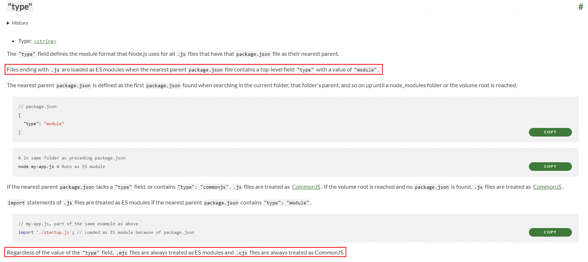
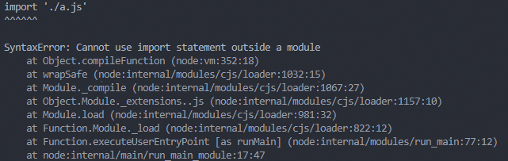

# package.json中type有什么用？

先看看Node官方解释：



**简单来讲，type配置用来标识Node.js使用ESM还是CommonJS的方式加载 `js` 文件。** 值得注意的是，这里讲的js文件专指以 `.js` 结尾的文件，因为文档最后特意注明了，`.mjs` 与 `.cjs` 结尾的文件，无论 `type` 设置为什么，`.mjs` 始终以ESM加载， `.cjs` 始终以CommonJS加载。

暂且放下 `.mjs` 与 `.cjs` 不管，接下来，以几个例子来看看设置不同 `type` 对 `.js` 文件的影响。

现在，我们通过 `pnpm init` 初始化一个Node.js项目，新增 `index.js` 文件：

```js
console.log('hello')
```

当我们使用 `node ./index.js` 运行该文件时，不会有任何报错发生，因为此时并没有触发模块的加载。我们只要把代码稍作修改：

1. 新增 `a.js` 文件
2. 将 `index.js` 的内容复制到 `a.js` 中
3. 修改 `index.js`

`index.js` 中，引入 `a.js` 模块：

```js
import './a.js'
```

此时再运行时，就报错了：



提示无法在模块外使用 `import` 语法，因为 `package.json` 初始化时，`type` 字段是没有设置的，此时Node.js将默认使用CommonJS的方式加载模块。因此，在CommonJS的模块中，无法使用 `import` 语法导入一个ESM的模块。

此时，我们将 `package.json` 的 `type` 字段设置为 `module`，再运行，就不会报错了。

