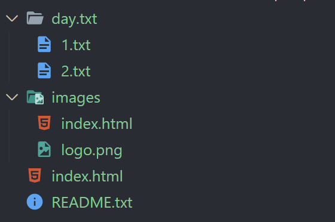

# 多页history路由问题在Vite下的的优雅解决


## 静态服务器原理

不管是在本地开发环境，还是线上运行环境，前端应用都需要在一个静态服务器下运行。

因此，在讨论这个经典话题前，还是有必要将静态服务器的一些解析规则讲清楚，才可以对问题的引发与解决理解地更为透彻。

假设服务器托管的文件夹的目录结构是：

<!-- - images
   - logo.png
   - logo.svg
- day.txt
   - 1.txt
   - 2.txt
   - 3.txt
   - 5.txt
   - exception
      - 4.txt
- index.html
- README.txt -->



接下来，让我们看几个案例：

| 访问 | 响应 | 解释 |
| -- |-- |-- |
| `http://localhost` | `index.html` | 当访问 `http://localhost` 或 `http://localhost/` 时，服务器会寻找默认的入口文件，绝大多数服务器会以 `index.html` 为入口文件，因此这里会返回根目录下的 `index.html` 文件。|
| `http://localhost/README.txt` | `README.txt` | 在根目录下存在 `README.txt` |
| `http://localhost/README` | 404 | 找不到名为 `README` 的文件 |
| `http://localhost/images` | `images/index.html` | 找不到名为 `images` 的文件，但是在 `images` 目录下找到了 `index.html` |
| `http://localhost/images/logo.png` | `images/logo.png` | 在 `images` 目录下找到了 `logo.png` 文件 |
| `http://localhost/day.txt` | 404 | 尝试寻找根目录下的 `day.txt` 文件，没有找到 |
| `http://localhost/day.txt/1.txt` | `/day.txt/1.txt` | 找到了 `day.txt` 下的 `1.txt` 文件 | 


从上述例子可以基本得出结论：

**服务器的URL解析规则很像文件系统，如路径 `/a/b/c` ，服务器会尝试在 `/a/b/` 目录下寻找名为 `c` 的文件。**

此外，

**如果找不到指定的文件，会将URL全部当成目录，尝试在目录下找到 `index.html` 文件并返回，如果没有，则响应404错误。**

除此之外，还有一个新手的一个典型误区，认为文件名后缀与文件内容存在关联关系，实际上，文件名后缀只是一个标识而已，就像有人叫张三，有人叫爱新觉罗·李四，尽管后者看起来好像有点特殊，但是其本质是一致的，只要把人区分开了就达到目的了。正如文件名，不管取什么名字，带不带后缀，都只是一种区分而已。

> 这也就是为什么在同一个目录下新建 `logo.png` 与 `logo.svg` 并不会冲突。

此外，对于静态服务器文件名后缀还有一个重要的意义：**文件名后缀与文件内容的类型有关联**。如请求 `logo.png` ，响应的 `content-type` 响应头为 `image/png` 。 `.png` 与 `image/png` 之间的映射关系就是配置在服务端的。

> 对于具有编程能力的动态服务器来说，文件后缀可有可无，因为动态服务器可以从数据库中获得真实的 `content-type` 并动态写出，这就是为什么很多OSS服务存储的文件并没有后缀名的原因。


## 问题引出 - 单页history路由问题

现在，你有一个单页应用（不限框架），单页下配置了路由，且路由类型为history。

在单页下，有一个 `/home` 路由，因此，完整的访问路径是：

`http://localhost/home`

按照我们前一章的探讨，访问这个URL时，服务器会尝试在根目录查找名为 `home` 的文件，很显然，并没有这个文件，因此会返回404。


没错，如果保持nginx服务器的默认配置，你将永远无法请求到 `index.html` 下的 `/home` 路由！

为了解决这个问题，你有可能会想到一个方案，访问这个URL：

`http://localhost/index.html/home`

但是又如前面所述，这个URL会让服务器尝试寻找 `index.html` 目录下的 `home` 文件，但是并没有这个文件，因此，还是404！

> 有人可能会觉得访问 `http://localhost/index.html/home` ，服务器会识别 `index.html` 是一个文件，并返回这个文件。这还是陷入了有后缀名是文件，无后缀名是目录的这种误区。

经过两轮尝试，基本可以确定的是，调整访问方式并不能达到想要的目的，此时我们需要调整服务器配置来实现。我们希望：

**当服务器找不到文件时，返回一个默认的文件，将这个默认文件指向 `index.html` ，这样就能使得单页应用与路由都工作正常。**

于是，我们在nginx的配置中找到一项配置：`try_files`。更改 `nginx.conf` 配置:

```
location / {
   root   /usr/share/nginx/html;
   index  index.html index.htm;
   try_files $uri $uri/ /index.html;
}
```

简单来说，这个配置可以达到的效果是：

**当访问以 `/` 开头的URL时，如果没有找到想要的文件，会返回 `root` 配置下 `/index.html` 文件。**

访问到 `index.html` 后，这个单页应用发生了这些事情：

1. 执行该单页下引入的script脚本
2. 启动一个Vue（或React或其他）的应用
3. 挂载路由，启动路由
4. 路由解析 `/home`，返回对应视图
5. 用户看到 `index` 单页下的 `/home` 路由内容

其中特别要提到的是路由的解析规则，以Vue Router为例，如果没有配置 `base` 参数，则默认 `base` 为 `/` ，即从域名（或端口）后开始解析，也即 `location.pathname` 。

<!-- 因此，当访问 `http://localhost/home` ，符合以 `/` 开头的条件，并且没有找到 `home` 文件，因此会返回 `index.html` 文件。 -->

<!-- 当 `index.html` 文件加载时，会启动Vue（或React或其他）应用，并挂载路由，由于路由也是从 `/` 开始解析，因此解析 `/home` 路径是正常的。 -->

以上所述为单页应用history路由的解决方案。

## 问题深入 - 多页history路由问题

前面说过，单页history的解决方案是：将本来会发生404的路由URL转向 `index.html` 文件并使用单页路由重新解析路径，从而得到正确的页面内容。

但是，如果我们的应用是多页的，除了 `index.html` 外，还有一个 `dev.html` ，但是上面的配置方法只能配置一个默认的返回文件，该怎么让它像单页应用一样工作这个正常？

经过前面的探索，很显然，我们并不能通过 `http://localhost/dev.html/home` 的方式来访问到 `dev` 单页。这种访问方式还是会返回 `index.html`，因为它同时满足以 `/` 开头和访问404的条件。

在多页的场景下，我们的目标是：

**将所有以 `/dev` （这个路径可以根据用户的需要灵活配置，不一定是单页名称）开头的请求指向 `dev.html` 文件。**

于是，在 `nginx.conf` 继续添加配置：

```
location /dev {
   root /usr/share/nginx/html;
   index index.html index.htm;
   try_files $uri $uri/ /dev.html;
}
```

其实，这里的配置本质与前一章中单页history的配置是一致的，思路都是：**将指定规则下的请求URL，当请求404时，指向一个默认的html入口文件。**

当我们访问 `http://localhost/dev/home` 时，服务器发生如下解析过程:

- URL以 `/dev` 开头，尝试在

## Vite多页history配置的终极解决方案

通过 `http://localhost/dev/home` 的方式来访问 `dev` 单页下的路由，既屏蔽了 `.html` 后缀，又完美实现了history路由，是多页应用在路由配置层面灵活度增大的表现。

经过以上的讨论，基本把多页应用history路由问题在nginx上的解决方案给剖析得很清楚了，接下来，我们讨论一个更为棘手的问题：

**开发阶段也是托管在静态服务器中的，也面临多页history路由访问的经典问题，该怎么解决？**

以下，将从Vite为例讲解在开发阶段的解决方案，其思路与nginx基本无异，将指定路径开头的请求指向不同的html文件。

首先，我们需要关注一个库：[connect-history-api-fallback](https://github.com/bripkens/connect-history-api-fallback)

这个库的作用就是实现请求的重写，让我们看一下它的玩法：

```js
import history from 'connect-history-api-fallback'

history({
   rewrites: [
      { from: /\/dev/, to: '/dev.html' }
   ],
   htmlAcceptHeaders: ['text/html', 'application/xhtml+xml'],
})
```

上述的配置将满足这两个条件的请求进行转发：

- `Accept` 请求头携带了 `text/html` 或 `application/xhtml+xml`
- 请求路径以 `/dev` 开头

满足上述两个条件的请求，响应会返回根目录下的 `dev.html` 文件。

在Vite中，通过插件的方式，我们可以将这个中间件加入到Vite的开发服务器中，请看代码（`vite.config.ts`）：

```ts
function historyPlugin() {
  return {
    name: 'vite-plugin-history',
      configureServer(server) {
        server.middlewares.use(history({
          rewrites: [
            { from: /\/dev/, to: '/dev.html' }
          ],
          htmlAcceptHeaders: ['text/html', 'application/xhtml+xml'],
        }))
      }
   }
}

export default defineConfig({
   plugins: [
      historyPlugin()
   ]
})
```

Vite插件提供了一个配置开发服务器的特有钩子，我们在这个阶段介入到开发服务器配置，去实现想要的功能。


## 最佳实践

综上，已将单页、多页history路由问题的引发原因与解决方案抽丝剥茧般讲解完毕。接下来，我们说点与实践相关的，防止在开发过程中不慎落入陷阱。

### 不要简单以单页名称作为转发的路径匹配规则

假设你有两个单页：

- index.html
- dev.html

在配置请求路径重写时，很多人会选择：

`/dev` -> `dev.html`

这种方式简单、直观，是最容易想到的方案。但是！这其中有坑。

试想一个问题：如果 `index.html` 单页下，有一个路由为 `/dev` ，此时访问 `http://localhost/dev` 该当如何？

答案是：永远都会转发到 `dev.html` ，而无法进入到 `index.html` 单页的 `/dev` 路由！

原理很简单，请求路径的重写发生在单页路由解析之前。

> 有人可能会觉得，自己的单页中不会取与其他单页名称相同的路由。这显然是一种莫名其妙的自信，因为单页的命名与单页下路由的命名是自由的，提前预知不会与他人的命名习惯发生冲突，这显然是不可能的。

因此，为了防止因为同名引起的冲突，我们可以使用这两个方案：

- 除 `index.html` 单页外，其他单页，使用特定规则的名称，如 `mpaDev.html`
- 在重写规则方面入手，将 `/mpa/dev` 转发到 `dev.html`

以上两个方案的本质都是通过加入特定的名称空间来防止命名冲突。


