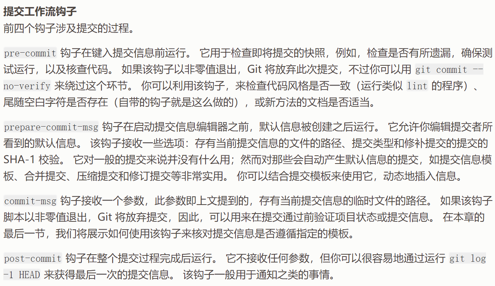

# 提交日志规范


## commintlint

[`commitlint`](https://github.com/conventional-changelog/commitlint)是一个校验提交日志的库，基本使用方法如下所示。

**安装**

```bash
pnpm i -D @commitlint/cli @commitlint/config-conventional
# yarn add -D @commitlint/cli @commitlint/config-conventional
# npm i -D @commitlint/cli @commitlint/config-conventional
```

**新增配置文件**

在项目根目录下新增`commitlint.config.js`文件，这里我们继承一个常用的配置即可：

```js
module.exports = {
  extends: [
    '@commitlint/config-conventional'
  ]
};
```

**使用cli检查一段文本是否符合规范**

```bash
echo 'foo: hello' | npx commitlint
```


## husky + commitlint

因为`husky`可以轻松管理git钩子，我们可以为git仓库新增一个`commit-msg`的钩子，在该钩子里拿到用户的提交日志并校验，如果提交日志不符合规范，则抛出错误。

首先，我们使用husky新增一个`commit-msg`钩子：

```bash
npx husky add .husky/commit-msg 'npx --no -- commitlint --edit ${1}'
```

然后，提交时就可以校验日志是否符合规范了：


***

*注：常见的git钩子：*

